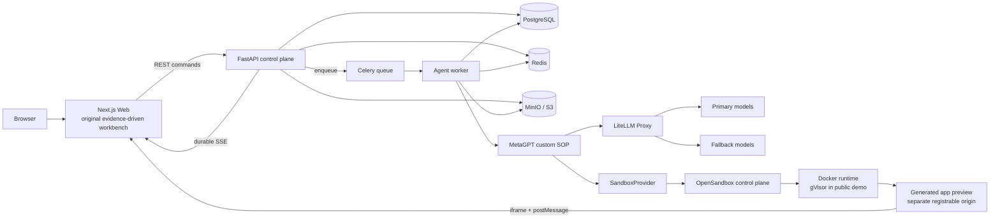
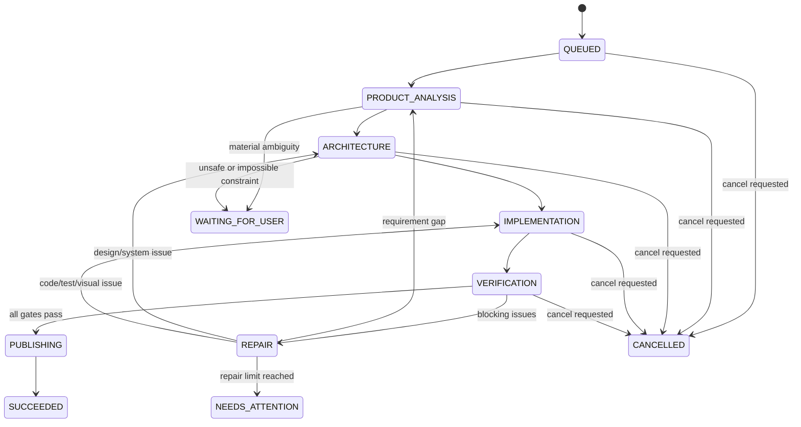

# FOMO 多角色 Coding Agent V1 技术设计

> 状态：Implementation Ready  
> 版本：1.1  
> 日期：2026-08-07  
> 适用范围：笔试项目第一版；里程碑按能力划分，不绑定 6–8 小时工期

## 1. 结论

V1 做成一个真正可运行、可迭代、可恢复的 Web Coding Agent，而不是一次性代码生成 Demo：用户输入需求后，Product Manager、Architect、Engineer、QA/Reviewer 四个角色依次协作，在隔离沙箱内生成并运行 Next.js 应用，前端持续展示角色进度、文件变化、命令输出、测试结果和真实预览；刷新页面后能够恢复项目和运行进度；每轮成功修改形成一个可回滚版本。

核心组合如下：

| 层 | 选型 | 责任边界 |
| --- | --- | --- |
| 前端工作台 | 本项目自研信息架构；官方 [`vercel/v0-sdk`](https://github.com/vercel/v0-sdk) `examples/v0-clone` 仅作 UX 参考和组件候选 | 围绕四角色、需求—证据图、代码/预览/问题联动自行设计；不调用 v0 生成服务 |
| Web 框架 | Next.js App Router + React + TypeScript + Tailwind CSS + shadcn/ui | 页面、项目工作台、服务端首屏数据 |
| AI UI | Vercel AI SDK `useChat` + AI Elements | 流式消息状态、类型化 data parts、AI 内容与工具结果展示 |
| 代码编辑 | Monaco Editor，动态加载 | 文件查看、编辑、diff 和错误定位 |
| 控制面 API | FastAPI + Pydantic + SQLAlchemy | 命令 API、SSE、鉴权、持久化、运行查询 |
| 异步执行 | Celery worker + Redis | 执行长任务、取消、重试和并发控制 |
| Agent 编排 | MetaGPT 自定义 SOP | 四角色、结构化交接、自愈循环；不直接调用 `generate_repo()` |
| 模型网关 | LiteLLM Proxy | 角色模型别名、跨供应商降级、用量和调用日志 |
| 沙箱 | OpenSandbox（本地 Docker，公开环境 Docker + gVisor），经 `SandboxProvider` 抽象 | 运行不可信代码、终端、独立预览、网络策略和可选快照；E2B 仅作云端备选 |
| 持久化 | PostgreSQL + Redis + MinIO/S3 | 业务真相、实时唤醒、代码包/截图/二进制工件 |
| 版本 | 沙箱内 Git + 数据库版本索引 + Git bundle | 每轮 checkpoint、回滚、下载和可审计历史 |
| 部署 | Web 在 Vercel；API/worker/LiteLLM 在容器平台 | 避免把长任务放进 Serverless 请求生命周期 |

一句话边界：**v0-clone 只提供可选的界面参考和组件候选，AI SDK 提供前端流式协议，MetaGPT 提供后端角色协作，OpenSandbox 提供可自托管的真实执行环境；需求—证据图、持久状态机、自愈和版本语义由本项目实现。**

## 2. 目标与非目标

### 2.1 V1 目标

1. 用户能从自然语言创建一个可运行的 Next.js Web 应用。
2. 四个角色全部真实参与，每个角色有独立输入、职责和结构化产物，不能只是 UI 上的四个头像。
3. 生成过程可见，但只展示计划、操作、结果和摘要，不暴露模型的原始思维链。
4. 代码必须在隔离沙箱中真实安装、构建、启动并被 iframe 预览。
5. QA 发现失败后能把诊断报告交还 Engineer 修复，再重新验证。
6. 项目、消息、事件、文件和版本刷新后不丢失；断流后可以续传。
7. 支持后续自然语言迭代、代码查看/编辑、版本回滚和项目下载。
8. 提供可公开访问的测试地址和公开源码，第三方可按 README 复现。

### 2.2 明确非目标

- V1 只承诺生成 Next.js/React Web 应用，不承诺任意语言、移动端或桌面端项目。
- 不实现多人实时协同编辑。
- 不让用户直接获得可交互的宿主机终端；V1 终端面板只展示 Agent 在沙箱中的命令和输出。
- 不把部署生成项目到生产环境作为成功条件；在线沙箱预览是 V1 的交付目标，正式部署是扩展项。
- 不把 v0 Platform API 当作默认生成引擎，否则核心能力会退化成 v0 的包装层。
- 不承诺 Agent 永不失败；失败必须可解释、可恢复，不能伪造成功。

## 3. 关键设计决策

### 3.1 为什么保留四个角色

不合并 Product Manager 和 Architect。这个项目追求展示效果和架构完整性，四个角色的价值来自不同的验收对象：

| 角色 | 只负责 | 必须输出 | 下游如何使用 |
| --- | --- | --- | --- |
| Product Manager | 把用户意图变成可验收需求 | `ProductSpec` | Architect 设计、QA 生成验收场景 |
| Architect | 把产品需求变成可执行技术方案 | `TechnicalSpec` | Engineer 的文件计划和实现约束 |
| Engineer | 在沙箱内修改代码并自检 | `ImplementationReport` + Git 工作区 | QA 从干净视角验证真实结果 |
| QA/Reviewer | 独立运行确定性检查和视觉审查 | `DiagnosticReport` | 通过则发布版本；失败由 `FailureRouter` 定向回灌 PM/Architect/Engineer |

在后续迭代中四个角色仍然出现，但 PM 输出 `ChangeImpact`，Architect 输出增量 `TechnicalDelta`，不会为了形式重复整份文档。

### 3.2 MetaGPT 和 Vercel AI SDK 不二选一

- MetaGPT 位于服务端，使用其 `Role`、`Action`、`Message` 和 SOP 思路实现角色协作。这与目标公司的开源项目一致，也允许我们控制角色产物、自愈、沙箱、版本和失败语义。
- Vercel AI SDK 位于浏览器侧，使用 `useChat`、`UIMessage`、自定义 data parts 和 transport 管理流式 UI。它不负责服务端四角色编排。
- 不同时运行 MetaGPT 和 AI SDK 两套后端 Agent loop，避免双重状态机和工具权限冲突。
- 不在 FastAPI 请求线程里调用 MetaGPT 的同步 `generate_repo()`；长任务由独立 worker 执行。

### 3.3 为什么不使用 v0 SDK 或整体 clone 作为产品核心

`v0.chats.create()`、`sendMessage()`、`deployments.create()` 会把代码生成、版本和预览交给 v0 托管服务。这样虽然最快，但面试作品的核心只剩 API 包装，四角色协作也很难证明是真实发生的。

因此不把 `v0-clone` 整体导入为底座。固定它的上游 commit 用于审计和参考，只选择通用视觉 primitive 或无业务耦合组件，在保留 License/归属的前提下移植并重写。工作台的信息架构、状态、API、事件、沙箱、需求—证据图和版本交互均由本项目实现。

### 3.4 为什么是 REST 命令 + SSE，而不是全量 WebSocket

- 用户提交、取消、保存、回滚都是离散命令，使用普通 HTTP 更容易做幂等和审计。
- Agent 过程是服务端到浏览器的单向事件流，SSE 自带顺序、事件 ID、心跳和重连语义。
- V1 终端是只读输出，不需要双向 PTY；未来开放交互终端时，再为 PTY 单独增加 WebSocket。
- 所有事件先写 PostgreSQL，Redis 只负责通知，因此断线、Redis 丢消息或 API 重启不会丢历史。

### 3.5 为什么 Git、数据库版本和 runtime snapshot 同时存在

- Git commit 是代码语义版本，适合 diff、恢复和下载。
- PostgreSQL 保存版本索引、文件清单和当前 head，适合产品查询。
- Git bundle/tarball 上传对象存储，是沙箱销毁后的持久副本。
- OpenSandbox runtime snapshot 只是加速启动的热路径，属于可选 capability，不是唯一真相来源。无论 runtime 是 Docker、gVisor 还是云端 Provider，容器/沙箱丢失后都必须能从 Git bundle、文件清单和 MinIO 工件重建。

### 3.6 产品特色：Spec-to-Proof Graph

本项目的核心产品语义不是“四个人格生成代码”，而是一张可查询的需求—证据图：

```text
UserRequest → Requirement/AC → ArchitectureDecision → FileChange
            ↘ TestCase → TestRun/Screenshot/BrowserError → Version
```

- PM 为每条原子需求和验收条件生成稳定 ID。
- Architect 的路由、组件、状态和测试计划必须反向引用对应 AC ID。
- Engineer 的每组 patch 必须声明所实现的 AC/设计决策；未关联变更在提交前被标记。
- Reviewer 不接受“已完成”的自述，只根据 test result、browser trace、console、screenshot 和 commit 给每个 AC 绑定证据。
- UI 中点击任意 AC，可直接联动到相关设计、diff、测试、问题和预览截图。
- 只有所有 `must` AC 具有通过证据，版本才能进入 `ready`。

这一层的 schema、关联规则、查询和交互全部由本项目实现，不属于 MetaGPT、v0、AI SDK 或 OpenSandbox 的能力。

## 4. 系统架构



### 4.1 服务边界

**Next.js Web**

- 负责首页、项目列表、工作台、消息/事件渲染、代码编辑器和预览 iframe。
- Server Components 只加载首屏项目快照；持续流式状态放在 Client Component 边界内。
- 浏览器直接连接 FastAPI 的 SSE，避免让 Vercel Route Handler 持有数分钟连接。
- 除 `NEXT_PUBLIC_API_URL` 外，浏览器包中不包含任何服务端凭据。

**FastAPI control plane**

- 验证 guest/user session 和项目所有权。
- 接受幂等命令，创建 run，写数据库并投递 worker。
- 从事件表回放历史，再用 Redis pub/sub 等待新事件。
- 提供项目、消息、工件、文件、版本和预览状态查询。
- 不执行 LLM 调用，不运行用户代码。

**Agent worker**

- 获取 project 级互斥租约，同一项目同一时刻只有一个写运行。
- 连接/恢复沙箱，运行 MetaGPT SOP 和工具调用。
- 把角色产物、命令、文件变化、验证结果和状态都写为持久事件。
- 检查取消标记，负责 checkpoint、打包、暂停沙箱和失败清理。

**LiteLLM Proxy**

- 对业务只暴露 `pm`、`architect`、`engineer`、`reviewer` 四个逻辑模型别名。
- 真实模型 ID 只出现在部署配置中，按角色设置主模型和跨供应商 fallback。
- 记录请求耗时、token、费用、错误和 trace ID；提示词正文默认脱敏后再记录。

**OpenSandbox**

- 只运行生成项目的依赖安装、开发服务器、构建和测试。
- 沙箱内不注入数据库、对象存储、模型或宿主平台密钥。
- worker 只调用 OpenSandbox API，不持有 Docker socket 或宿主容器权限。
- 本地开发使用 Docker Runtime；公开接受任意 prompt 的环境使用 Linux + gVisor `runsc`。
- 通过 OpenSandbox Ingress 暴露预览，生成项目的网络请求和 iframe 与宿主应用隔离在不同 registrable origin。

## 5. 前端设计

### 5.1 页面结构

桌面端采用三段式工作台：

1. 左侧：项目历史、创建项目、当前运行状态。
2. 中间：用户对话、四角色时间线、公开活动摘要、修复轮次。
3. 右侧：`Preview / Code / Terminal / Problems` 标签页，顶部包含设备尺寸、刷新、打开新窗口、版本选择和下载。

窄屏改为 `Chat / Workspace` 双标签，不缩成无法使用的三栏。

### 5.2 对官方 v0-clone 的参考与选择性移植

固定 `vercel/v0-sdk` commit `27a1d36728f33bc135f507f33c0d9ed04ab4a633` 作为审计锚点，不在当前仓库运行整体生成器或覆盖应用。凡移植代码均保留上游 License、commit 和来源记录。

| 处理 | 内容 |
| --- | --- |
| 参考后自研 | 三段式工作台、响应式面板、Prompt 输入和 Preview/Code 切换；信息架构围绕角色产物和 Spec-to-Proof Graph 重新设计 |
| 可选择性移植 | 无 v0 数据模型耦合的纯 UI primitive、文件树显示和面板 resize 细节；移植后纳入本项目测试和视觉系统 |
| 替换 | `V0Transport` → `AgentEventTransport` |
| 替换 | `@v0-sdk/react/swr` → 本项目 API client + SWR 查询 |
| 替换 | `/api/chats/**` v0 代理 → FastAPI `/v1/**` |
| 替换 | v0 message parts → 本项目类型化角色/工件/命令/验证 parts |
| 不引入 | API key 对话框、v0 模型选择、v0 deploy、v0/Vercel 名称与 logo |
| 不引入 | 原 preview proxy 的 v0 凭据逻辑；预览由 OpenSandbox Ingress 返回独立 origin |

官方示例本身没有本地用户系统或数据存储，所有 chat/file 数据来自 v0 API，因此不能原样部署。

### 5.3 AI SDK 的使用方式

定义一个类型化消息，而不是把所有事件塞进字符串：

```ts
type AgentUIMessage = UIMessage<
  {
    projectId: string
    runId: string
    createdAt: string
    status: RunStatus
  },
  {
    "agent-role": AgentRolePart
    "product-spec": ProductSpecPart
    "technical-spec": TechnicalSpecPart
    "acceptance-trace": AcceptanceTracePart
    "file-change": FileChangePart
    command: CommandPart
    verification: VerificationPart
    preview: PreviewPart
    version: VersionPart
    notification: NotificationPart
  }
>
```

`AgentEventTransport` 实现 AI SDK 的 chat transport 边界：

1. `sendMessages` 取最新用户消息，以 `clientMessageId` 调用 `POST /projects/{id}/messages`。
2. API 返回 `runId` 后，transport 通过 fetch 打开 `GET /runs/{runId}/events`。
3. transport 把领域事件映射为 `UIMessageChunk`；同一实体使用稳定 `id`，利用 data part reconciliation 原位更新状态。
4. `reconnectToStream` 查询活动 run，并从本地保存的最后 `seq` 继续。
5. `AbortSignal` 只终止浏览器读取；用户点击 Stop 时还必须调用 cancel API，不能把断开连接误认为任务取消。

映射约定：

| 领域事件 | UIMessage part | 展示 |
| --- | --- | --- |
| `agent.started/activity/completed` | `data-agent-role` | 四角色时间线卡片 |
| `artifact.upserted` | `data-product-spec` / `data-technical-spec` | 可展开的结构化工件 |
| `trace.updated` | `data-acceptance-trace` | AC 与设计、diff、测试、截图、版本的关系和状态 |
| `file.changed` | `data-file-change` | 文件名、增删行、状态 |
| `command.*` | `data-command` | 终端命令、流式输出、退出码 |
| `verification.updated` | `data-verification` | 测试、构建、视觉检查 |
| `preview.ready` | `data-preview` | 自动切换或刷新 iframe |
| `version.created` | `data-version` | commit、版本和恢复入口 |
| `assistant.summary` | `text-*` | 对用户可读的阶段总结 |

AI Elements 只安装实际使用的组件：`conversation`、`message`、`prompt-input`、`agent`、`plan`、`file-tree`、`terminal`、`stack-trace`、`test-results`、`web-preview`、`commit` 和 `code-block`。所有模型生成的 Markdown 使用 `MessageResponse`/对应消息组件渲染；组件通过 registry 复制进仓库后按产品视觉定制。

### 5.4 客户端状态

- 服务端数据：SWR，缓存项目摘要、文件内容、版本列表和 run 快照。
- 流式状态：AI SDK `useChat<AgentUIMessage>`。
- 工作台瞬时状态：轻量 Zustand store，只保存选中 tab、文件、面板尺寸、设备宽度和最后事件序号。
- URL 是可分享状态：`/projects/{projectId}?file=...&version=...`。
- 事件 reducer 必须按 `(runId, seq)` 去重，忽略旧 seq；刷新时以服务端快照为基线，再接增量事件。

### 5.5 代码和预览体验

- Monaco 仅在用户首次打开 Code 标签时动态加载，避免拖慢首屏。
- 文件树先取 manifest，文件正文按需请求；二进制文件只展示元数据/预览。
- 用户编辑保存时必须带 `baseVersionId` 和文件 hash；冲突返回 `409`，禁止静默覆盖 Agent 新版本。
- Preview iframe 使用 OpenSandbox Ingress 返回的独立预览域名，允许应用正常 hydration，但不与宿主共享 cookie 或 registrable origin。
- 生成模板注入最小 `preview-bridge`，仅通过 `postMessage` 上报 `console`、`error`、`unhandledrejection` 和当前 URL。宿主严格校验 origin、run ID 和消息 schema。
- Preview 面板提供桌面、平板、手机三个 viewport；刷新按钮重载 iframe，不重启 run。

## 6. Agent 设计

### 6.1 状态机



默认最多三次修复路由。这个上限是为了保证状态机有终点，而不是为了省模型成本；可通过项目配置提高，但不能无限循环。同一问题 fingerprint 连续两轮没有改善时，即使未达上限也不能继续盲目重试，必须升级到 Architect 重新规划或进入 `NEEDS_ATTENTION`。

### 6.2 MetaGPT 集成

不修改 MetaGPT 源码，在 `agent_runtime` 中实现适配层：

```text
SOPRunner
├── ProductManagerRole
│   └── WriteProductSpecAction
├── ArchitectRole
│   └── WriteTechnicalSpecAction
├── EngineerRole
│   └── ImplementInSandboxAction
└── ReviewerRole
    └── VerifyAndReviewAction
```

约束：

- 使用自定义 Pydantic schema 校验每个 Action 的最终产物，解析失败允许同角色定向重试。
- MetaGPT Message 只在角色间传递引用和摘要；大文件、日志、截图通过 ArtifactStore 引用，避免消息总线承载大对象。
- SOPRunner 是唯一状态转换者，角色不能自行宣布 run 成功或直接创建产品版本。
- 每个角色使用独立上下文窗口。Reviewer 不接收 Engineer 的“已经完成”结论，只接收 ProductSpec、TechnicalSpec、代码 commit 和实际工具结果。
- MetaGPT pin 到经过测试的 commit；初始复现锚点为 `11cdf466d042aece04fc6cfd13b28e1a70341b1f`，Python 固定 3.11，因为当前 MetaGPT 官方要求 Python `>=3.9,<3.12`。

### 6.3 结构化交接物

**ProductSpec**

```json
{
  "title": "string",
  "problem": "string",
  "targetUsers": ["string"],
  "userStories": [{ "id": "US-1", "story": "string", "priority": "must" }],
  "acceptanceCriteria": [{ "id": "AC-1", "given": "", "when": "", "then": "" }],
  "pages": [{ "route": "/", "purpose": "", "keyElements": [] }],
  "visualDirection": { "tone": "", "colors": [], "references": [] },
  "assumptions": [],
  "outOfScope": []
}
```

**TechnicalSpec**

```json
{
  "framework": "nextjs",
  "routes": [{ "path": "/", "rendering": "client", "description": "" }],
  "components": [{ "name": "", "responsibility": "", "children": [] }],
  "stateModel": [{ "name": "", "owner": "", "persistence": "", "stateClass": "persistent_business", "mutableDomains": [""] }],
  "persistentStateDomains": [{ "domain": "", "stateModelName": "", "actionsStoreFile": "" }],
  "stateAggregation": {
    "filePath": "",
    "responsibilities": ["compose", "re_export"],
    "persistenceAdapter": {
      "filePath": "",
      "publicSymbol": "",
      "storageKey": "",
      "schemaVersion": 1,
      "responsibilities": ["load", "save", "migrate"]
    }
  },
  "dependencies": [{ "name": "", "reason": "" }],
  "filePlan": [{ "path": "", "operation": "create|modify|delete", "reason": "" }],
  "testPlan": [{ "acceptanceId": "AC-1", "method": "playwright", "steps": [] }],
  "risks": []
}
```

当显式声明的持久业务域达到三个及以上时，`persistentStateDomains.actionsStoreFile`、
`stateAggregation.filePath` 与 `StatePersistenceAdapterSpec.filePath` 必须是彼此不同、已在
`filePlan` 中声明且可由模型写入的非删除文件；adapter 的 `(filePath, publicSymbol)` 必须绑定
到 `publicApiContracts`。aggregation 仅组合和 re-export，禁止 storage I/O 或 migrate；adapter
仅负责 load/save/migrate，禁止 CRUD 或 UI。

**ImplementationReport** 至少包含基准版本、已实现 AC ID、设计决策 ID、变更文件、执行命令、已知限制和候选 commit；**DiagnosticReport** 至少包含每个 gate 的状态、关联 AC ID、问题 fingerprint、责任角色、阻断问题、证据、定位文件、建议修复和截图引用。

### 6.4 Engineer 工具

Engineer 只能通过以下应用工具操作，所有实现最终落到沙箱：

- `list_files`, `read_file`, `search_files`
- `write_file`, `apply_patch`, `delete_file`
- `run_command`，支持 stdout/stderr 流和超时
- `read_package_manifest`
- `git_diff`, `git_status`
- `get_runtime_errors`

策略：

- 首轮从受控 Next.js starter 开始，不让模型自己选择任意脚手架。
- V1 固定使用 `fomo-next-radix-v1`：镜像与 control plane 都持有同一份 vendored
  Next/TypeScript/Tailwind/Radix shadcn 源码、pnpm lock 和 Playwright 配置。创建 sandbox 后先复制，
  按逐文件 SHA-256 与 canonical tree SHA-256 校验，再创建 `chore(starter)` 初始 Git commit 并持久化
  starter provenance。
- Architect 只接收 compact StarterManifest（可用 imports、受保护路径、model-owned roots 和 scripts）；
  TechnicalSpec 与 Engineer 写入前都拒绝 starter/system 路径。常规路由、业务组合、领域状态和 smoke tests
  分别位于 `app/(generated)/**`、`components/features/**`、`lib/domain/**` 与 `tests/**`。
- 小改动优先 unified diff；新文件或大范围重构允许整文件写入。
- Engineer 单个 create/modify 文件默认以 12,000 字符为拆分目标，20,000 字符为唯一硬拒收线；
  通过 `ENGINEER_TARGET_FILE_CHARACTERS` 与 `ENGINEER_MAX_FILE_CHARACTERS` 配置，二者必须为正数、
  target 不得超过 hard，且 hard 不得超过 24,000。`len(content)` 超过硬线才拒绝。介于两者之间且
  batch 已持久化时，仅追加一次不含路径或源码的 `file_batch_over_target` 活动，记录目标、最大观测长度和
  超目标文件数。
- 禁止“修改第 N 行”式脆弱指令。
- 每次工具调用带 `operationId`，worker 重试时先检查是否已执行。
- 依赖安装只发生在沙箱；V1 不允许模型修改固定 starter 的 `package.json` 或锁文件，缺少能力必须记录为风险，
  由后续受控 starter 版本演进处理。
- 模型不能直接写 `.env*`、Git hooks、宿主配置或沙箱外路径。

### 6.5 QA 与自愈

QA 使用确定性工具和独立 Reviewer 判断，按顺序运行：

1. 依赖和锁文件一致性检查。
2. `pnpm typecheck`。
3. lint（项目启用时）。
4. `pnpm build`。
5. 启动应用并等待健康检查返回 2xx。
6. 根据 `acceptanceCriteria` 生成并运行 Playwright smoke tests。
7. 收集浏览器 console error、page error 和失败网络请求。
8. 对桌面和手机截图做多模态视觉审查，检查溢出、空白、不可读、明显错位和需求缺失。

只有 `error`/`major` 级问题阻断版本发布；`minor` 作为已知问题展示。`FailureRouter` 根据证据把需求遗漏回灌 PM、系统/组件边界问题回灌 Architect，把编译、测试和视觉实现问题回灌 Engineer。回灌内容是结构化 DiagnosticReport 和最小相关日志，不是整段无筛选终端输出。

## 7. 沙箱、预览和版本

### 7.1 SandboxProvider

业务层只依赖以下能力，不出现 OpenSandbox、E2B 或容器 runtime 的专有类型：

```python
class SandboxProvider(Protocol):
    async def capabilities(self) -> SandboxCapabilities: ...
    async def create(self, project_id: UUID, source: SourceRef | None) -> SandboxRef: ...
    async def connect(self, ref: SandboxRef) -> SandboxSession: ...
    async def exec(self, ref: SandboxRef, command: Command, sink: OutputSink) -> ExecResult: ...
    async def read_file(self, ref: SandboxRef, path: str) -> bytes: ...
    async def apply_changes(self, ref: SandboxRef, changes: list[FileChange]) -> None: ...
    async def expose(self, ref: SandboxRef, port: int) -> PreviewRef: ...
    async def snapshot(self, ref: SandboxRef) -> SnapshotRef: ...
    async def pause(self, ref: SandboxRef) -> None: ...
    async def kill(self, ref: SandboxRef) -> None: ...
```

`SandboxCapabilities` 明确声明 `snapshot`、`pause_resume`、`public_preview` 和 `network_policy` 是否可用；运行时不根据异常文本猜测 Provider 能力。

V1 只实现 `OpenSandboxProvider`：

- 本地开发：OpenSandbox Server + Docker Runtime，不需要外部 sandbox API key。
- 公开 Demo：OpenSandbox Server + 专用 Linux runner + gVisor `runsc`。
- `E2BSandboxProvider` 保留为可选云端 adapter，不是 V1 启动、测试或验收的必需条件。
- 不再另写一套直接操作 Docker socket 的 `DockerSandboxProvider`；Docker 只是 OpenSandbox 后端 runtime，避免重复实现生命周期、命令流、Ingress 和网络策略。

### 7.2 OpenSandbox runtime 和基础镜像

自定义基础镜像预装 Node.js 22、pnpm、Git、Playwright Chromium、常用构建工具和受控 Next.js starter；OpenSandbox 在创建沙箱时注入 `execd`。镜像使用不可变 tag + digest 锁定，其中不放任何长期密钥。

安全配置：

- OpenSandbox control plane 只开放在 API/worker 可访问的内网，启用独立 API key；浏览器不能访问 lifecycle/exec API。
- worker 不挂载 `/var/run/docker.sock`；只有隔离的 OpenSandbox runtime service 能管理沙箱。
- 生成沙箱使用非 root UID、`no-new-privileges`、删除 Linux capabilities、只读 rootfs 和独立可写 `/workspace`；不挂载宿主代码或密钥目录。
- 对 CPU、内存、PID、磁盘、命令时间和输出字节设硬限额。
- 依赖安装阶段只放行受信包源；运行阶段默认断开外网，按项目显式需求增加 egress allowlist。
- 公开 Demo 不允许使用普通 Docker runtime 承载任意用户代码；必须使用 gVisor/Kata/Firecracker 之一，V1 部署基线为 gVisor。

生命周期：

1. 新项目由 OpenSandbox 从锁定基础镜像创建；历史项目先连接已记录的 sandbox。
2. 连接失败或 sandbox 已被回收时，创建新 sandbox，再从最新 Git bundle/tarball 恢复；sandbox ID 永远不是持久存储。
3. worker 通过 Filesystem/Command API 写文件和执行命令，stdout/stderr 直接映射为持久事件。
4. 开发服务健康后，通过 OpenSandbox Ingress 获得 `PreviewRef`；宿主只保存短期 URL、精确 origin 和过期时间。
5. run 成功后先提交 Git、上传 bundle 和文件清单，再根据 capability 创建可选 runtime snapshot。
6. 空闲时根据 capability 执行 pause 或 kill；恢复/重建前发 `sandbox.reconnecting`，完成后重启事件采集、开发服务和 preview health check。

### 7.3 Git 版本规则

- 项目初始化时创建 `main`，首次可运行结果是 `v1`。
- 每个 run 从数据库记录的 `head_version_id` 对应 commit 开始。
- Engineer 完成后产生候选 commit；QA 通过后创建正式 `version` 记录和 tag `version/{number}`。
- commit message 示例：`feat(agent): run 01J... implement AC-1 AC-2`，trailers 写入 `Run-Id` 和 `Parent-Version`。
- 回滚不会删除历史：先确认当前工作区已 checkpoint，再切到目标 commit，创建一个新的 restore commit 和新版本记录。
- `Download` 从目标版本的持久归档生成，而不是依赖仍然存活的沙箱。

## 8. 数据设计

PostgreSQL 是业务真相来源，所有主键使用 UUIDv7，时间使用 UTC `timestamptz`。

| 表 | 关键字段 | 说明 |
| --- | --- | --- |
| `sessions` | `id`, `kind`, `user_id?`, `expires_at` | guest session 可日后升级为账号 |
| `projects` | `id`, `owner_session_id`, `title`, `status`, `head_version_id`, `active_run_id` | 项目聚合根 |
| `messages` | `id`, `project_id`, `role`, `content`, `client_message_id`, `run_id` | `client_message_id` 保证提交幂等 |
| `runs` | `id`, `project_id`, `base_version_id`, `status`, `phase`, `repair_round`, `cancel_requested_at`, `error_code` | 一次初始生成或修改 |
| `run_events` | `id`, `run_id`, `seq`, `kind`, `role?`, `payload jsonb`, `created_at` | 唯一索引 `(run_id, seq)` |
| `artifacts` | `id`, `run_id`, `kind`, `schema_version`, `content jsonb`, `object_key?` | ProductSpec 等结构化产物 |
| `spec_items` | `id`, `project_id`, `stable_key`, `kind`, `priority`, `content jsonb`, `introduced_run_id`, `retired_run_id?` | Requirement/AC 的可查询投影；完整原文仍以 artifact 为准 |
| `trace_links` | `id`, `run_id`, `source_kind`, `source_ref`, `relation`, `target_kind`, `target_ref`, `metadata jsonb` | AC→设计→文件→测试→证据→版本的有向关系 |
| `verification_evidence` | `id`, `run_id`, `acceptance_key`, `kind`, `status`, `artifact_id?`, `object_key?`, `summary` | 测试、浏览器 trace、console、截图等可核验证据 |
| `versions` | `id`, `project_id`, `number`, `commit_sha`, `parent_version_id`, `bundle_key`, `snapshot_id?`, `qa_status` | 不可变版本元数据 |
| `version_files` | `version_id`, `path`, `sha256`, `size`, `mime`, `content_text?`, `object_key?` | 文本快速读取，二进制进对象存储 |
| `sandbox_leases` | `project_id`, `provider`, `sandbox_id`, `state`, `lease_owner`, `lease_expires_at` | 防止并行写同一工作区 |
| `model_calls` | `id`, `run_id`, `role`, `model_alias`, `latency_ms`, `input_tokens`, `output_tokens`, `status` | 可观测性，不默认存完整 prompt |

`artifacts` 是不可变产物，`spec_items`、`trace_links` 和 `verification_evidence` 是可从产物/事件重建的查询投影。一个 Action 的 artifact、投影更新和对应 `run_event` 在同一数据库事务中提交，防止 UI 显示不存在的证据边。

必须建立的索引：

- `projects(owner_session_id, updated_at desc)`
- `messages(project_id, created_at)`
- `runs(project_id, created_at desc)` 和每项目仅一个活动写 run 的部分唯一索引
- `run_events(run_id, seq)` unique
- `spec_items(project_id, stable_key)` unique where `retired_run_id is null`
- `trace_links(run_id, source_kind, source_ref)` 和 `trace_links(run_id, target_kind, target_ref)`
- `verification_evidence(run_id, acceptance_key, status)`
- `versions(project_id, number)` unique
- `version_files(version_id, path)` unique

Redis 只承担 Celery broker、短期 project lock、取消信号和 `run:{id}` pub/sub 唤醒。Redis 数据丢失不得导致项目、事件或版本丢失。

## 9. API 与事件协议

### 9.1 核心 API

所有 mutation 支持 `Idempotency-Key`，错误统一返回 RFC 9457 Problem Details。

| 方法 | 路径 | 用途 |
| --- | --- | --- |
| `POST` | `/v1/sessions/guest` | 创建/续期匿名会话 |
| `GET/POST` | `/v1/projects` | 项目列表、创建项目 |
| `GET/PATCH` | `/v1/projects/{projectId}` | 项目快照、重命名 |
| `POST` | `/v1/projects/{projectId}/messages` | 保存用户消息并创建 run，返回 202 |
| `GET` | `/v1/runs/{runId}` | run 当前快照和最后 seq |
| `GET` | `/v1/runs/{runId}/events` | SSE；支持 `Last-Event-ID` 或 `after` |
| `POST` | `/v1/runs/{runId}/cancel` | 请求安全取消 |
| `GET` | `/v1/projects/{projectId}/files` | 指定版本文件树 |
| `GET/PUT` | `/v1/projects/{projectId}/files/content` | 读取/保存单文件 |
| `GET` | `/v1/projects/{projectId}/versions` | 版本列表 |
| `GET` | `/v1/projects/{projectId}/trace` | 指定 run/version 的 Spec-to-Proof Graph 和 AC 覆盖状态 |
| `POST` | `/v1/projects/{projectId}/versions/{versionId}/restore` | 非破坏式恢复并创建新版本 |
| `GET` | `/v1/projects/{projectId}/download` | 下载指定版本源码 |
| `GET` | `/v1/projects/{projectId}/preview` | 当前 preview 状态和受信 origin |

提交消息示例：

```json
{
  "clientMessageId": "01K...",
  "content": "把首页改成深色 CRM 仪表盘，并增加手机布局",
  "baseVersionId": "019...",
  "attachments": []
}
```

如果项目正在运行，新的修改默认进入 FIFO 队列并在 UI 显示 `queued`；用户可显式停止当前 run。V1 不允许两个 Agent 并行写同一项目。

### 9.2 事件信封

```text
id: 42
event: run.event
data: {"schemaVersion":1,"eventId":"019...","seq":42,"projectId":"...","runId":"...","kind":"verification.updated","role":"reviewer","occurredAt":"2026-08-07T10:00:00Z","payload":{...}}

```

事件种类：

```text
run.created | run.status_changed | run.cancel_requested
agent.started | agent.activity | agent.completed | agent.failed
artifact.upserted | trace.updated
file.changed
command.started | command.output | command.completed
verification.updated
sandbox.reconnecting | preview.ready | preview.failed
version.created | version.restored
assistant.summary
run.waiting_for_user | run.completed | run.failed | run.cancelled
```

规则：

- `seq` 在单个 run 内严格递增，客户端至少一次接收、按 seq 去重。
- 先提交数据库事务，再 best-effort publish Redis；SSE 每次被唤醒都从数据库补读。
- 每 15 秒发送 SSE comment heartbeat；代理层关闭 buffering 和 response cache。
- `command.output` 以 50 ms 或 4 KiB 为窗口批量落库，避免逐字符事件风暴。
- 不发送原始 chain-of-thought。`agent.activity` 只能包含用户可见的计划、当前动作和简短依据。
- 终态事件发出后连接可以关闭；刷新时 `GET run` + 历史事件可完整重建 UI。

## 10. 持久化、一致性与恢复

### 10.1 写入顺序

关键状态变化使用同一数据库事务：

1. 更新 `runs/projects/artifacts/versions`。
2. 分配下一 `seq` 并插入 `run_events`。
3. commit。
4. 向 Redis 发布只含 `{runId, seq}` 的唤醒通知。

发布 Redis 失败不回滚业务事务；SSE 的定时补读最终会发现新事件。

### 10.2 幂等和 worker 崩溃

- `messages(project_id, client_message_id)` 唯一，浏览器重试不会创建两个 run。
- Celery 是至少一次投递；worker 开始前用数据库 compare-and-set 获取 run lease。
- 每个外部操作有 `operationId`，结果写入事件后才进入下一状态。
- worker 重启后根据 run phase、artifact 和 Git 状态恢复，不重新执行已成功步骤。
- 模型调用本身不可完全幂等；重试生成新 `model_call`，但只有持有有效 lease 的 worker 可以提交结果。

### 10.3 刷新和断流

1. 页面 SSR/首次请求读取 project snapshot、messages、active run 和 `lastSeq`。
2. 客户端 reducer hydrate。
3. 若有 active run，以已应用的 seq 打开 SSE。
4. API 回放 `seq > after` 的事件，再等待 Redis 通知。
5. 如果预览 sandbox 正在恢复，保留最后截图并显示 reconnecting，不展示空白成功态。

## 11. 安全设计

### 11.1 不可信预览隔离

- 宿主应用和生成预览必须位于不同 registrable origin；不能只使用同站子域来假装隔离。
- iframe 最小化 sandbox 权限；只在跨 origin 前提下启用运行 React 必需的 `allow-scripts`、`allow-same-origin` 和表单能力。
- 宿主不向 iframe 发送 session、API key、数据库连接或任意 bearer token。
- `postMessage` 双方校验精确 origin、schema 和 run nonce；预览消息不能触发宿主 mutation。
- CSP 的 `frame-src` 只允许当前 `PreviewRef` 中经校验的 OpenSandbox preview host，API 只允许明确的 Web origin CORS。

### 11.2 沙箱和 Agent 权限

- 所有用户/模型代码只在 `SandboxProvider` 管理的沙箱内执行，控制面和 worker 容器绝不直接运行生成命令。
- OpenSandbox lifecycle/exec API 仅允许 worker 所在内网访问；其 API key 不进入生成沙箱或前端。
- 本地 Docker Runtime 只用于受信开发和 CI；公开任意用户输入必须在 gVisor 或更强隔离 runtime 中执行。
- 规范化并校验文件路径，拒绝绝对路径、`..`、符号链接逃逸和敏感文件名。
- 命令有超时、输出上限、进程组取消和资源上限。
- 上传内容和仓库文本都视为不可信数据，不能覆盖 system policy 或获取宿主工具。
- 沙箱网络默认只满足包安装和应用运行；后续可增加 egress allowlist。
- 日志和错误对密钥、cookie、Authorization header 做统一脱敏。

### 11.3 会话

- 公共 Demo 默认创建 guest session，使用 Secure、HttpOnly、SameSite cookie，访问无登录摩擦。
- guest 只能访问自己创建的项目；分享功能以后使用独立、可撤销、只读 share token。
- mutation 校验 Origin/CSRF；速率限制按 session 和 IP 双维度执行。

## 12. 可观测性

每个用户动作贯穿 `request_id → project_id → run_id → trace_id → model_call_id/command_id`。

必须采集：

- 首个事件时间、各角色耗时、首次 preview 时间、run 总耗时。
- 模型成功率、fallback 次数、token、费用和结构化输出重试次数。
- sandbox 创建/恢复时间、命令退出码、构建失败类型。
- QA 首次通过率、平均修复轮数、最终未解决问题。
- SSE 活跃连接、重连次数、事件落库到前端的延迟。
- run 成功、失败、取消、waiting-for-user 分布。

日志为 JSON；OpenTelemetry 负责跨 API/worker/LiteLLM trace。生产错误接入 Sentry 或等价平台，但不把用户完整源码默认发送给第三方。

## 13. 测试策略

### 13.1 本仓库测试

| 层 | 必测内容 |
| --- | --- |
| 单元测试 | 状态机、FailureRouter/fingerprint、Spec-to-Proof 连边规则、事件 reducer、data part 映射、路径校验、Git 版本规则、结构化 schema |
| 契约测试 | OpenAPI 生成 TS 类型；Python event schema 与前端 decoder 兼容 |
| 集成测试 | fake LLM + fake sandbox 跑完整 SOP；Redis 通知丢失时仍可从 PG 补读 |
| Provider 契约测试 | `FakeSandboxProvider` 和本地 `OpenSandboxProvider` 共用同一套 create/exec/files/expose/cleanup 契约 |
| 故障测试 | worker 在每个 phase 崩溃、SSE 重连、重复 POST、OpenSandbox 重启/sandbox 丢失、模型 fallback |
| 浏览器 E2E | 创建项目、看到四角色、真实预览、刷新恢复、二次修改、自愈、版本回滚 |
| 安全测试 | 越权项目 ID、路径穿越、恶意 iframe message、敏感日志脱敏、CORS/CSRF |

CI 默认使用确定性的 fake model 和 fixture，不把真实 LLM 的随机性作为合并门槛；保留手动/定时 real-model smoke workflow。

### 13.2 生成应用的发布门槛

一个版本只有同时满足以下条件才标记 `ready`：

- typecheck/build 通过。
- preview health check 通过并可加载。
- 至少一个根据核心 AC 生成的 Playwright 流程通过。
- 每个 `must` AC 都存在至少一条当前 run 的 `passed` 证据，且不能引用旧版本过期截图/测试。
- 浏览器无未处理 page error；阻断级 console error 为零。
- Reviewer 没有 `error` 或 `major` 级问题。
- Git commit、版本记录和对象存储 bundle 全部写入成功。

任何一项失败都不能发送 `preview_ready + success` 的假成功组合。

## 14. 仓库结构

```text
fomo/
├── apps/
│   └── web/                         # original workbench; attributed upstream snippets only
│       ├── app/
│       ├── components/
│       │   ├── ai-elements/
│       │   ├── agents/
│       │   ├── chat/
│       │   ├── editor/
│       │   └── preview/
│       └── lib/
│           ├── api/
│           ├── events/
│           └── transport/
├── services/
│   └── control-plane/
│       ├── pyproject.toml
│       └── src/fomo/
│           ├── api/                 # FastAPI routes/dependencies
│           ├── worker/              # Celery app/tasks
│           ├── agent_runtime/
│           │   ├── roles/
│           │   ├── actions/
│           │   ├── schemas/
│           │   ├── context/          # 角色可见上下文编译
│           │   ├── evidence/         # Spec-to-Proof Graph
│           │   ├── repair/           # FailureRouter + fingerprint
│           │   └── sop.py
│           ├── sandbox/
│           ├── eventing/
│           ├── persistence/
│           └── observability/
├── packages/
│   └── contracts/                   # OpenAPI output + shared JSON schemas
├── infra/
│   ├── compose.yaml                 # PG, Redis, MinIO, LiteLLM, OpenSandbox
│   ├── opensandbox/                 # server config, base image, local runtime
│   ├── gvisor/                      # public runner installation/policy
│   └── deploy/
├── tests/
│   └── e2e/
├── DESIGN.md
├── THIRD_PARTY_NOTICES.md
├── LICENSE
├── pnpm-workspace.yaml
├── pyproject.toml                   # uv workspace
└── README.md
```

API 和 worker 使用同一 Python package、同一容器镜像但不同启动命令，避免复制领域逻辑。

## 15. 配置

服务端最小配置：

```dotenv
APP_ENV=development
WEB_ORIGIN=http://localhost:3000
DATABASE_URL=postgresql+asyncpg://...
REDIS_URL=redis://...
S3_ENDPOINT_URL=http://localhost:9000
S3_BUCKET=fomo-artifacts
AWS_ACCESS_KEY_ID=fomo
AWS_SECRET_ACCESS_KEY=...
SANDBOX_PROVIDER=opensandbox
OPENSANDBOX_BASE_URL=http://opensandbox:8080
OPENSANDBOX_API_KEY=...
OPENSANDBOX_IMAGE=fomo-sandbox-node:2026-08-08
OPENSANDBOX_RUNTIME=docker
OPENSANDBOX_PREVIEW_DOMAIN=preview.localhost
# Optional cloud adapter; V1 local startup does not require these values.
E2B_API_KEY=
E2B_TEMPLATE_ID=
LITELLM_BASE_URL=http://litellm:4000
LITELLM_MASTER_KEY=...
MODEL_PM=pm
MODEL_ARCHITECT=architect
MODEL_ENGINEER=engineer
MODEL_REVIEWER=reviewer
SESSION_SIGNING_KEY=...
```

浏览器只需要：

```dotenv
NEXT_PUBLIC_API_URL=http://localhost:8000
```

所有依赖精确锁在 `pnpm-lock.yaml` 和 `uv.lock`，仓库脚本和 CI 中禁止使用漂移的 `latest`。选择性移植上游组件时先保留其已验证组合（Next.js 16.2.4、React 19.2.5、AI SDK 7.0.31、`@ai-sdk/react` 4.0.34），完成纵向切片后再单独升级；2026-08-07 可评估的最新版本分别为 Next.js 16.3.0、AI SDK 7.0.56 和 `@ai-sdk/react` 4.0.59。

## 16. 部署拓扑

推荐公开 Demo：

| 组件 | 平台 |
| --- | --- |
| `apps/web` | Vercel |
| FastAPI、Celery worker、LiteLLM | Railway/Fly.io/Render 的长驻容器 |
| PostgreSQL | Neon 或同等级托管 PG |
| Redis | Upstash 或同等级托管 Redis |
| 对象存储 | Cloudflare R2/S3 |
| OpenSandbox control plane | 专用 Linux VM/容器服务，只开放内网 API |
| 沙箱 runner | 专用 Linux VM，Docker + gVisor `runsc` |
| 云端备选 | E2B 或 Vercel Sandbox，仅通过后续 Provider adapter 接入 |

域名建议：

- `app.example.com`：宿主 Web。
- `api.example.com`：控制面和 SSE。
- `*.example-preview.net`：OpenSandbox Ingress 暴露的不可信生成应用；必须与 `example.com` 使用不同 registrable domain。

API/worker 使用同一镜像分别启动；迁移作为单独 release command。健康检查分为 liveness 和数据库/Redis readiness。Web 部署不拥有数据库迁移权限。

## 17. 能力里程碑与验收

不写时间估算，按可独立验收的能力推进；用户可以在任意里程碑后决定是否停止。

### M0：可复现基座

- 审计固定 v0-clone commit，只选择性移植必需的无业务耦合代码，完成第三方声明。
- 建立 pnpm/uv workspace、compose、CI 和环境变量模板。
- 自研静态工作台可启动，不含 v0 运行时依赖和品牌。

验收：新机器按 README 一次启动 Web/API/worker/PG/Redis/MinIO/LiteLLM/OpenSandbox，不需要 E2B key。

### M1：真实纵向切片

- 用户创建项目并提交 prompt。
- API 创建 run，worker 通过 OpenSandbox API 在独立沙箱写入固定/单 Agent 示例项目。
- SSE 展示真实命令和文件变化，Preview 加载真实应用。
- project/run/events 刷新后恢复。

验收：从 prompt 到 iframe 全链路无 mock，断开 SSE 再连接不丢事件。

### M2：四角色 SOP

- 接入四个 MetaGPT Role/Action。
- ProductSpec、TechnicalSpec、ImplementationReport、DiagnosticReport 均通过 schema 校验并可在 UI 展开。
- 生成 `spec_items`、`trace_links` 和初始 AC 覆盖视图；点击 AC 可联动上游产物与下游文件。
- 角色时间线、文件树、Monaco 和终端完整联动。

验收：数据库和 UI 都能证明四角色产物被下游实际消费。

### M3：QA 自愈和视觉审查

- typecheck/build/Playwright/console/截图审查全部真实运行。
- `FailureRouter` 把阻断问题按需求/架构/实现类型回灌 PM、Architect 或 Engineer，最多三次；无进展或超限进入 `needs_attention`。
- Problems 面板能从诊断跳到对应文件。

验收：人为植入编译错误和运行时错误时，系统能修复或诚实失败。

### M4：迭代、版本和恢复

- 多轮自然语言修改基于指定版本。
- 每轮成功生成 Git 版本、bundle 和文件快照。
- 支持代码保存、版本 diff、下载和非破坏式回滚。
- worker/OpenSandbox 故障或原 sandbox 被回收后可从持久数据恢复。

验收：修改前后版本均可预览；回滚后历史仍完整；销毁 sandbox 后可重建。

### M5：面试级完成度

- guest session、项目历史、限流和安全头完整。
- 响应式布局、空态、错误态、取消态、恢复态和加载骨架完整。
- OpenTelemetry/错误监控、核心指标和公开 Demo 运维完成。
- README 包含架构、运行、演示、限制、许可证和测试结果。

验收：陌生评审者无需口头指导即可完成创建、观察、预览、修改和回滚。

## 18. 面试演示脚本

推荐用一个视觉和交互都明显、但边界可控的需求，例如：

> 创建一个深色 SaaS 销售仪表盘，包含可筛选 KPI、趋势图、交易表格和手机端布局；点击交易行打开详情抽屉，并提供空数据状态。

演示顺序：

1. 提交需求，立即看到 run 和 PM 活动。
2. 展开 ProductSpec 和 Architect 的页面/组件/test plan，点击一条 AC 查看它即将约束的设计和测试。
3. 切到 Code/Terminal，看真实文件和命令变化。
4. QA 执行 build、浏览器测试和截图审查；若触发修复，展示 FailureRouter 回灌与证据更新闭环。
5. Preview 中真实交互并切换手机 viewport。
6. 刷新浏览器，证明消息、事件、代码和 preview 能恢复。
7. 用一句自然语言修改主题或交互，生成第二版本。
8. 查看 diff，再恢复到第一版本。

## 19. 风险与处理

| 风险 | 处理 |
| --- | --- |
| MetaGPT 默认 software company 路径与产品流程不匹配 | 只复用框架原语，自己定义 Role/Action/SOP，不调用黑盒 `generate_repo()` |
| 四角色变成冗长表演 | 强制结构化产物和消费关系；公开摘要限长，详细工件折叠 |
| 需求—证据关系漂移或被模型伪造 | 稳定 AC ID、schema/foreign-key 校验、工具产生的证据引用；Reviewer 不能自由填写不存在的 test/screenshot ID |
| LLM 产出不稳定 | schema validation、工具结果为准、角色模型别名和跨供应商 fallback |
| SSE 断线或 Redis 丢通知 | PG 持久事件、seq、Last-Event-ID、定时补读 |
| OpenSandbox 或单个 sandbox 不可用 | 租约过期后创建新 sandbox，用 Git bundle + version_files + MinIO 工件重建 |
| 普通 Docker 隔离不足 | 本地只运行受信测试；公开 Demo 使用独立 Linux runner + gVisor，严格限额和 egress policy |
| preview 代码攻击宿主 | 独立 registrable origin、iframe sandbox、无 secrets、严格 postMessage schema |
| 自动修复无限循环 | 严格状态机、默认三轮、问题指纹去重、无进展即 needs_attention |
| 选择性移植 v0-clone 时带入不必要耦合 | 建立参考/移植/不引入清单；只移植无业务数据依赖的小组件，以本项目契约和测试为准 |
| 依赖升级破坏 AI SDK/AI Elements 类型 | 锁版本、仅安装所需 Elements、升级单独提交并跑 typecheck/E2E |

## 20. 开工顺序

1. 在临时目录取得固定 commit 的 `v0-clone` 用于审计，先建立“参考/移植/不引入”清单，不在当前根目录运行生成器或覆盖自研工作台。
2. 对实际移植的代码添加 Apache-2.0 License 归属和 `THIRD_PARTY_NOTICES.md`；不引入品牌、v0 API 依赖和业务状态。
3. 先定义 Pydantic/OpenAPI 的 Project、Run、Event、Version 契约，并生成 TypeScript 类型。
4. 完成 M1 的“固定生成器”纵向切片，先验证 OpenSandbox、SSE、持久化和独立 preview iframe，而不是一开始调四套 prompt。
5. 用相同接口把固定生成器替换成 MetaGPT 四角色 SOP。
6. 接入确定性 QA、自愈、Git 版本和故障恢复。
7. 最后做视觉打磨、Atoms 辅助的局部 UI 变体和公开部署；Atoms 产物只作为视觉参考或组件候选，不覆盖已经可运行的前端架构。

## 21. 禁止项

- 禁止把 raw chain-of-thought 作为 `thought` 事件展示或持久化。
- 禁止在 API 请求进程里执行 MetaGPT、包管理器或生成代码。
- 禁止把 Redis、OpenSandbox/runtime snapshot、sandbox 文件系统或浏览器 localStorage 当唯一持久存储。
- 禁止在同一项目上并行运行两个写 Agent。
- 禁止在 QA 未通过时把 run 标记成功。
- 禁止把 v0 SDK API key、OpenSandbox/E2B key、模型 key 或对象存储 key 发到浏览器/生成应用。
- 禁止复制 v0 品牌资产；开源代码许可不等于商标许可。
- 禁止在未跑 typecheck、build 和核心 E2E 前升级 AI SDK/AI Elements。

## 22. 参考资料

- [笔试需求](https://deepwisdom.feishu.cn/wiki/N3UmwkrlTigucVkqRWVcsGxBn64?renamingWikiNode=false)
- [MetaGPT 官方仓库](https://github.com/FoundationAgents/MetaGPT)
- [Vercel v0 SDK 官方仓库](https://github.com/vercel/v0-sdk)
- [官方 v0-clone 示例与安全说明](https://github.com/vercel/v0-sdk/blob/main/examples/v0-clone/README.md)
- [Vercel AI SDK：UI stream protocol](https://ai-sdk.dev/docs/ai-sdk-ui/stream-protocol)
- [Vercel AI SDK：streaming custom data](https://ai-sdk.dev/docs/ai-sdk-ui/streaming-data)
- [AI Elements](https://ai-sdk.dev/elements)
- [OpenSandbox 官方仓库](https://github.com/opensandbox-group/OpenSandbox)
- [OpenSandbox 架构](https://github.com/opensandbox-group/OpenSandbox/blob/main/docs/architecture.md)
- [gVisor Docker runtime](https://gvisor.dev/docs/user_guide/quick_start/docker/)
- [E2B 开源仓库（可选 Provider）](https://github.com/e2b-dev/e2b)
- [Vercel Sandbox（可选 Provider）](https://vercel.com/docs/sandbox)
- [Vercel 商标政策](https://vercel.com/legal/trademark-policy)
