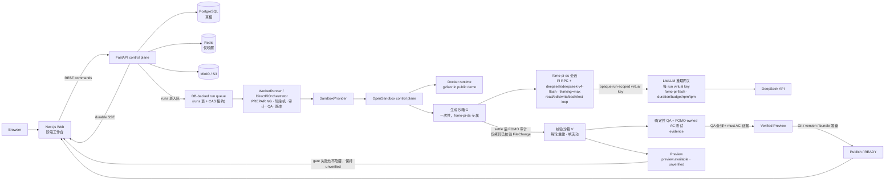
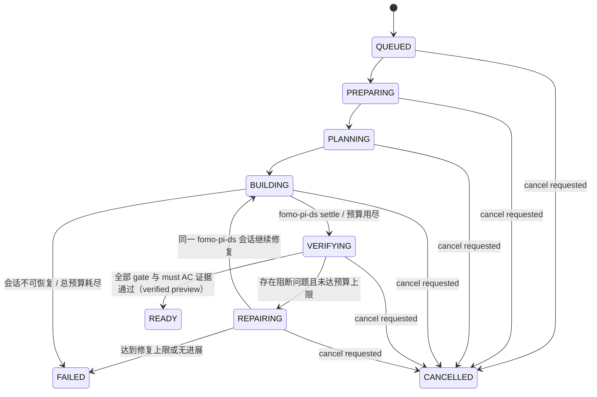

# FOMO 直接 Pi Coding Agent 技术设计（V2）

> 状态：设计已批准——直接 Pi（fomo-pi-ds）为目标架构；fomo-pi-ds RPC runtime 尚未实现。初始纵向切片只交付 `preview.available`（unverified），在 M3 证据完成前不得声称 READY（见 §17 与 §23）<br>
> 版本：2.1<br>
> 日期：2026-08-08（最近更新）<br>
> 适用范围：笔试项目；里程碑按能力划分，不绑定工期

## 1. 结论

FOMO 是一个真实可运行、可迭代、可恢复的 Web Coding Agent：用户提交原始需求后，FOMO 作为**唯一持久控制面**首先进入 **PREPARING**——冻结原始需求、约束与可选的 userAcceptanceNotes、SourceRef 与一个固定由服务端拥有的 V2 starter profile（本笔试 V2 恒为 `base + crud + local-persistence` 全量组合，不做动态能力选择），随后创建一次性生成沙箱 **G** 并启动唯一的持续 **fomo-pi-ds 会话**（Pi RPC + DeepSeek，固定 `deepseek/deepseek-v4-flash`、`thinking=max`）完成 `read/edit/write/bash/test` 连续 loop。进入 **PLANNING** 后 fomo-pi-ds 产出 BuildPlan（仅展示/咨询）与建议的 **AcceptanceContract**（acceptanceCriteria + testSpecs，AC 由模型提议、FOMO 只做可执行校验）；FOMO 校验并冻结后才进入 BUILDING。settle 后 FOMO 以**实际文件系统 diff 与 manifest 为准**审计，把通过校验的变更复制到每轮重建的干净校验沙箱 **V**；权威的 dependency/typecheck/build/harness smoke/逐 AC Playwright/preview health 只在 V 运行，且**逐 AC 证据只信任 FOMO 拥有的 `tests/fomo-acceptance/**` 测试**（由冻结的 AcceptanceContract 确定性编译），Pi 自检测试（`tests/generated/**`）永不作为发布证据。V 的 dev server 一旦 health 2xx 立即发布 `preview.available`（`verificationStatus=unverified`），即使后续 gate 失败也不隐藏；项目 QA 与逐 AC 证据全部通过后才升级为 **Verified Preview**，再经 Git/版本落盘才 **Publish/READY**。验证失败时，FOMO 把最小结构化 `DiagnosticReport` 回传**同一个 fomo-pi-ds 会话**继续修复；成功或达到上限后销毁 G。

核心组合如下：

| 层 | 选型 | 责任边界 |
| --- | --- | --- |
| 前端工作台 | 本项目自研信息架构 | 围绕真实阶段（Preparing/Planning/Building/Verifying/Repairing/Ready/Failed）、AcceptanceContract、BuildPlan、需求—证据图、Preview 三态与版本自行设计 |
| Web 框架 | Next.js App Router + React + TypeScript + Tailwind CSS + shadcn/ui | 页面、项目工作台、服务端首屏数据 |
| AI UI | Vercel AI SDK `useChat` + AI Elements | 流式消息状态、类型化 data parts、AI 内容与工具结果展示；不参与 Agent 编排 |
| 代码编辑 | Monaco Editor，动态加载 | 文件查看、编辑、diff 和错误定位 |
| 控制面 API | FastAPI + Pydantic + SQLAlchemy | 命令 API、SSE、鉴权、持久化、运行查询 |
| 异步执行 | DB-backed worker/lease queue：`fomo-worker` 常驻进程轮询 `runs` 表领取租约；Redis 仅负责唤醒与取消信号，不承载队列状态 | 执行 run loop、取消、恢复和并发控制；不使用 Celery |
| 实现 Agent | 每 run 一个持续 fomo-pi-ds 会话（Pi RPC + DeepSeek），固定 `deepseek/deepseek-v4-flash`、`thinking=max` | 仅在生成沙箱 G 内做 read/edit/write/bash/test 连续 loop；产出 BuildPlan（咨询）与 AcceptanceContract 提案 |
| 模型出口 | LiteLLM 推理网关（强制，独立 litellm PostgreSQL 库） | 每 run 经 `/key/generate` 签发 opaque virtual key（仅 `fomo-pi-flash` alias、duration、max_budget、单并发、rpm/tpm），终态 block；路由官方 DeepSeek API；无跨模型 fallback |
| 沙箱 | OpenSandbox（本地 Docker，公开环境 Docker + gVisor），经 `SandboxProvider` 抽象 | 生成沙箱 G（fomo-pi-ds 专属）与校验沙箱 V（QA/证据/Preview/Git 专属）；每项目同一时刻最多一个活动 V |
| 持久化 | PostgreSQL + Redis + MinIO/S3 | 业务真相、实时唤醒、代码包/截图/二进制工件 |
| 版本 | 沙箱内 Git + 数据库版本索引 + Git bundle | 每轮 checkpoint、回滚、下载和可审计历史 |
| 部署 | Web 在 Vercel；API/worker/LiteLLM 在容器平台 | 避免把长任务放进 Serverless 请求生命周期 |

一句话边界：**v0/AI SDK 不参与生成与编排，FOMO 拥有状态、lease、SSE、沙箱生命周期、审计、确定性 QA、AC evidence、Git、Preview、版本与发布语义；fomo-pi-ds 只拥有 G 内的连续写代码与自检；G 内自检仅供参考，权威验证只在 V；fomo-pi-ds 不拥有验收测试（`tests/fomo-acceptance/**` 由 FOMO 冻结并拥有）、Git、Preview、版本或发布权。** 需求—证据图、持久状态机、审计、修复回路与版本语义全部由本项目实现。

实现现状：直接 Pi（fomo-pi-ds）是已批准的目标架构；fomo-pi-ds RPC runtime 仍是待实现工作项，当前仓库为 legacy 实现，仅在一段简短迁移说明（§23）中提及，不再作为设计方案。

**术语约定**：`codex-pi-ds` 指 Codex 开发 FOMO 时在本机或独立 worktree 调用的 Pi CLI + DeepSeek，属于外部开发工具链，不属于 FOMO 产品 runtime、数据库状态、版本真相或恢复语义；`fomo-pi-ds` 指 FOMO 产品运行时在受控生成沙箱 G 内启动的 Pi RPC + DeepSeek 会话，是产品架构的一部分。两者的 session、权限、状态、凭据与生命周期完全隔离（边界规则见 §3.9）。设计正文中出现的"Pi 会话"均指 fomo-pi-ds。

## 2. 目标与非目标

### 2.1 V2 目标

1. 用户能从自然语言创建一个可运行的 Next.js Web 应用。
2. PREPARING 由 FOMO 独占冻结需求/约束、SourceRef 与固定 starter profile，消除"计划先于种子"的循环依赖。
3. 每个 run 只有一个持续的 fomo-pi-ds 会话完成实现，固定模型与 `thinking=max`；过程可见但只展示计划、动作、结果与摘要，不暴露思维链。
4. 工作台展示真实阶段（Preparing/Planning/Building/Verifying/Repairing/Ready/Failed），并联动冻结的 AcceptanceContract、BuildPlan（标注"仅展示/咨询"）、文件与命令活动、验证结果、AC evidence、Preview 三态（Preview / Verified Preview / Publish）与版本。
5. 代码必须在隔离沙箱中真实安装、构建、启动并被 iframe 预览；权威验证只在干净校验沙箱 V 中运行；逐 AC 证据只来自 FOMO 拥有的 `tests/fomo-acceptance/**`。
6. V 的 dev server health 2xx 后立即提供可交互 preview（`unverified`），后续 gate 失败也不隐藏；只有 QA 全绿且 must AC 证据齐备才升级为 Verified Preview，再经 Git/版本落盘才发布。
7. 验证失败时，最小结构化 `DiagnosticReport` 回传同一 fomo-pi-ds 会话继续修复，V 每轮重建；预算为 run-total 非重置，耗尽即停。
8. 项目、消息、事件、文件和版本刷新后不丢失；断流可续传；fomo-pi-ds 会话崩溃可重启且 run 状态不重置。
9. 支持后续自然语言迭代、代码查看/编辑（手工编辑走 manual-edit run，不直接改动版本）、版本回滚、历史版本只读预览和项目下载。
10. 提供可公开访问的测试地址和公开源码，第三方可按 README 复现。

### 2.2 明确非目标

- V2 只承诺生成 Next.js/React Web 应用，不承诺任意语言、移动端或桌面端项目。
- 不实现多人实时协同编辑；不让用户直接获得可交互的宿主机终端。
- 不把部署生成项目到生产环境作为成功条件；在线沙箱预览是交付目标。
- 不采用固定串行角色 SOP（PM→Architect→Engineer→Reviewer）或人格化展示；不做 legacy-vs-Pi 公平 A/B 对照；不引入 LangGraph 或默认主/子多 Agent 编排。
- 不做动态能力选择：V2 恒为服务端固定的全量 starter profile（base + crud + local-persistence）。
- 没有 WAITING_FOR_USER 暂停态：需求澄清通过新的用户消息/新 run 表达，不中断当前阶段机。
- 不承诺 Agent 永不失败；失败必须可解释、可恢复，不能伪造成功；unverified 的 preview 可以存在，但不能被标成成功。

## 3. 关键设计决策

### 3.1 为什么直接 Pi（fomo-pi-ds 单持续会话）

现代 coding agent 的连续 `read/edit/write/bash/test` loop 对"从需求到可运行应用"的端到端任务，优于固定串行角色流水线：

- **上下文连续**：同一会话贯穿 Building 与 Repairing，修复轮次共享记忆，避免角色各自冷启动重读全文。
- **计划随证据演化**：模型自形成轻量 BuildPlan，在执行中根据真实工具结果修正，不预先僵化为逐文件生成合同。
- **单一模型、单一配置**：固定 `deepseek/deepseek-v4-flash`、`thinking=max`，可复现、可预算，不需要多角色模型别名与 fallback 矩阵。
- **官方无人值守接口**：fomo-pi-ds 构建在官方 Pi `--mode rpc`（LF 分隔 JSONL 的 stdin/stdout 协议）之上，FOMO 可以把它作为可管理、可丢弃、可重启的执行会话嵌入，而不是黑盒进程。
- fomo_pi_ds 是**唯一**具体的运行路径：代码中只保留一个很小的 `PiRuntime` 协议，仅用于 fake 测试与依赖注入，不是用户可选的后端（见 §6.2）。

### 3.2 为什么不要四角色 / MetaGPT / LangGraph / 默认子 Agent

- 固定 PM→Architect→Engineer→Reviewer 串行 SOP 本质是流程表演：产物交接成本高、上下文碎片化、FailureRouter 回灌路径复杂，且无法证明比单个连续 Agent 更好；本项目不做 A/B，也不需要保留两条链路做对照。
- MetaGPT 的 Role/Action/Message 集成、定制 SOP、`ImplementationPlan→FileBatchReport` 分批整文件 JSON 生成，都是该模式的专属设施，全部删除且不维护；不保留为历史背景或双真相。
- LangGraph 与默认主/子多 Agent 方案不采用：一个持续会话足够，多 Agent 引入第二套状态与调度复杂度。
- **单一写路径**：同一项目同一时刻只有一个写执行者（唯一 fomo-pi-ds 会话），这是不可协商的并发前提。

### 3.3 FOMO 是唯一持久控制面

| 能力 | 归属 |
| --- | --- |
| PostgreSQL 状态、lease、recovery | FOMO |
| PREPARING（冻结需求/SourceRef/starter profile）与 AcceptanceContract 冻结 | FOMO 独占 |
| SSE 事件协议与历史回放 | FOMO |
| 沙箱生命周期（G/V 创建、重建、销毁；单活动 V） | FOMO |
| 安全审计（路径、manifest、diff、预算） | FOMO |
| 确定性 QA（依赖/typecheck/build/harness smoke/逐 AC Playwright/preview health） | FOMO，只在 V |
| 逐 AC evidence 与需求—证据图（只信 `tests/fomo-acceptance/**`） | FOMO |
| Git commit、Verified Preview、Version、Publish | FOMO，只在 V |
| 受保护的 FOMO 管理测试（含 `tests/fomo-acceptance/**`） | FOMO，fomo-pi-ds 只读不可改 |
| 写代码与快速自检 | fomo-pi-ds（仅 G 内） |

运行链：**WorkerRunner → DirectPiOrchestrator → fomo_pi_ds**。WorkerRunner 是 DB-backed 队列的领取者；DirectPiOrchestrator 独占持有 run loop 与全部阶段转换；fomo-pi-ds 会话不持有任何 FOMO 语义：它不知道 run 状态机、版本号、QA 门禁或发布流程；它只是一次可丢弃的执行会话。

### 3.4 G/V 分离：自检 vs 权威

- **G（生成沙箱）**：一次性，每 run 一个；fomo-pi-ds 会话在其中连续执行。fomo-pi-ds 可以做快速自检（如单文件 typecheck、局部命令、`git diff` 只读、运行 `tests/generated/**` 自检测试），结果仅供参考，不构成证据。
- **审计**：fomo-pi-ds settle 后，FOMO 以实际文件系统 diff 与 manifest 为准审计，只把通过校验的 UTF-8 FileChange 拷入干净的 V。不信任自然语言自述——任何"已完成"声明必须能映射到 V 内的工具证据。
- **V（校验沙箱）**：每轮验证**重建**（干净、确定性、无 fomo-pi-ds 残留）；dependency/typecheck/build/harness smoke/逐 AC Playwright/preview health 只在 V 运行；Git 候选提交、Preview 与版本只在 V 完成。每项目同一时刻最多一个活动 V lease。
- **修复回路**：验证失败时 FOMO 生成最小结构化 `DiagnosticReport`，回传**同一个 fomo-pi-ds 会话**继续修复；V 销毁并在下一轮重建；成功或达到上限后销毁 G。

### 3.5 为什么是 REST 命令 + SSE + DB-backed queue

- 用户提交、取消、保存、回滚都是离散命令，普通 HTTP 更容易做幂等和审计。
- Agent 过程是服务端到浏览器的单向事件流，SSE 自带顺序、事件 ID、心跳和重连语义。
- 终端是只读输出，不需要双向 PTY；未来开放交互终端时再为 PTY 单独增加 WebSocket。
- 队列以 PostgreSQL 为真相：`runs` 表排队（`status=queued`），`fomo-worker` 常驻进程用数据库 compare-and-set 领取租约轮询执行；Redis 只做 pub/sub 唤醒（避免空轮询延迟）与取消信号，不承载队列状态。不引入 Celery：当前仓库没有 Celery 依赖，单 worker 常驻进程 + DB 租约即可满足 V2。
- 所有事件先写 PostgreSQL，Redis 只负责通知，因此断线、Redis 丢消息或 API 重启不会丢历史。

### 3.6 为什么 Git、数据库版本和 bundle 同时存在

- Git commit 是代码语义版本，适合 diff、恢复和下载。
- PostgreSQL 保存版本索引、文件清单和当前 head，适合产品查询。
- Git bundle/tarball 上传对象存储（MinIO/S3），是沙箱销毁后的持久副本。
- OpenSandbox runtime snapshot 只是加速启动的热路径，属于可丢弃的 hash 校验缓存，不是唯一真相来源。容器/沙箱丢失后都必须能从 Git bundle、文件清单和 MinIO 工件重建。

### 3.7 需求—证据图（Spec-to-Proof Graph）

本项目的核心产品语义是一张可查询的需求—证据图：

```text
UserRequest → AcceptanceContract(AC/testSpec) → FileChange → FOMO-owned TestRun/Screenshot/BrowserError → Version
```

- AC 与测试规格由 fomo-pi-ds 在 PLANNING 提议于有界的 AcceptanceContract：每个 acceptance criterion 有稳定 id、must/should 优先级与 given/when/then，每个 testSpec 显式引用 acceptanceIds；FOMO 只做可执行校验（schema、数量、非平凡、DSL 白名单、与原始需求不为空/不冲突）并冻结，不生成业务语义。
- 逐 AC 证据**只来自** FOMO 拥有的 `tests/fomo-acceptance/**`（由冻结的 AcceptanceContract 确定性编译）；`tests/generated/**` 是 fomo-pi-ds 的自检测试，永不作为发布证据。**证据证明的是 BUILDING 前冻结的合同所描述的行为（criterion 的 given/when/then 与 testSpec 的断言），不是独立模型对产品语义的二次判断。**
- File→AC 边要求显式且校验通过的 `acIds`/`testSpecId`；无法证明归属的变更标记为 `unattributed`，绝不推断。
- UI 中点击任意 AC，可直接联动到相关 diff、FOMO-owned 测试、问题和预览截图。
- 只有所有 `must` AC 具有通过证据（且项目 QA 全绿），preview 才能升级为 Verified，版本才能进入 `ready`。

这一层的 schema、关联规则、查询和交互全部由本项目实现，不属于 fomo-pi-ds、AI SDK 或 OpenSandbox 的能力。

### 3.8 真相模型

- **持久真相（durable truth）**：不可变 `RunInput`、冻结的 `AcceptanceContract`、`SourceRef`（Git commit/version_files + starter manifest）、审计通过的候选 patch 与文件清单、V 内的验证证据（`verification_evidence`）。
- **可丢弃缓存**：G/V 沙箱、runtime snapshot、`pi_sessions` 记录、fomo-pi-ds 转录——全部可随时销毁重建，只作为 hash 校验过的缓存，绝不作为恢复或版本真相。
- **手工编辑**：用户在 Code 面板保存文件时，FOMO 创建 **manual-edit run**，走与生成 run 完全相同的审计/V/QA/版本链；绝不直接修改任何已 `ready` 版本。

### 3.9 术语与边界：codex-pi-ds 与 fomo-pi-ds

| 命名 | 含义 | 归属 |
| --- | --- | --- |
| `codex-pi-ds` | Codex 开发 FOMO 时在本机或独立 worktree 调用的 Pi CLI + DeepSeek | 外部开发工具链；不属于 FOMO 产品 runtime、数据库状态、版本真相或恢复语义 |
| `fomo-pi-ds` | FOMO 产品运行时在受控生成沙箱 G 内启动的 Pi RPC + DeepSeek 会话 | 产品架构；由 DirectPiOrchestrator 按输入契约创建、管理、销毁 |

边界规则（不可协商）：

- 两者的 session、权限、状态、凭据与生命周期完全隔离；禁止互相读取、复用（session/缓存/凭据）或作为恢复真相。
- `codex-pi-ds` 不读 FOMO 的 PostgreSQL/事件/沙箱，不持有产品凭据；`fomo-pi-ds` 不继承开发机配置或 `codex-pi-ds` 的 session/缓存。
- 设计正文中的"Pi 会话"均指 `fomo-pi-ds`；`codex-pi-ds` 只在术语、边界与开发说明（§23）中出现。
- 代码路径与配置值使用 `fomo_pi_ds`（Python 标识符），正文命名使用 `fomo-pi-ds`。

## 4. 系统架构



### 4.1 服务边界

**Next.js Web**

- 负责首页、项目列表、工作台、消息/事件渲染、代码编辑器和预览 iframe。
- 工作台展示真实阶段与活动，不做角色人格化；Preview 面板区分 Preview（unverified）/ Verified Preview / Publish 三态。
- Server Components 只加载首屏项目快照；持续流式状态放在 Client Component 边界内。
- 浏览器直接连接 FastAPI 的 SSE，避免让 Vercel Route Handler 持有数分钟连接。
- 除 `NEXT_PUBLIC_API_URL` 外，浏览器包中不包含任何服务端凭据。

**FastAPI control plane**

- 验证 guest/user session 和项目所有权。
- 接受幂等命令，创建 run，写数据库入队（`runs` 表），并通过 Redis 唤醒 worker。
- 从事件表回放历史，再用 Redis pub/sub 等待新事件。
- 提供项目、消息、工件、AcceptanceContract、文件、版本和预览状态查询。
- 不执行 LLM 调用，不运行用户代码，不启动 fomo-pi-ds 进程。

**Run worker（WorkerRunner + DirectPiOrchestrator）**

- `WorkerRunner`：常驻进程，用数据库 CAS 从 `runs` 表领取租约（至少一次投递语义），持有 project 级互斥。
- `DirectPiOrchestrator`：独占 run loop——PREPARING 冻结输入 → 创建 G → 启动/重启 fomo-pi-ds 会话 → PLANNING 冻结 BuildPlan 与 AcceptanceContract → BUILDING 收集活动 → settle 后审计 → 重建 V → 运行确定性 QA → 写 AC evidence → 通过则 Verified Preview、Git/版本/发布，失败则生成 DiagnosticReport 回传同一会话。
- 把阶段、BuildPlan、AcceptanceContract、文件变化、命令、验证结果和状态都写为持久事件。
- 检查取消标记，负责预算执行（run-total 非重置 + per-command 上限）、checkpoint、打包、暂停沙箱和失败清理。

**fomo-pi-ds 会话（实现 Agent）**

- 每个 run 一个持续会话，仅存在于 G 内；stdout 是严格有界的 JSONL 协议通道，stderr 只是有界、脱敏的诊断输出。
- 只接收 FOMO 编译的输入契约（§6.3），只使用沙箱工具（§6.5），不感知 run 状态机、QA、Git、Preview、版本与发布。
- fomo-pi-ds 会话可被 FOMO 随时终止、重启（重启必须在由 durable truth 重建或校验后的 G 中进行，注入上下文摘要与最近 DiagnosticReport）；会话本身可丢弃，绝不作为恢复或版本真相。

**LiteLLM 推理网关（强制）**

- LiteLLM 使用**独立 PostgreSQL 数据库**与自己的 master key；宿主侧 FOMO 配置名 `LITELLM_DATABASE_URL` 由 compose 映射为 LiteLLM 容器内的 `DATABASE_URL`（LiteLLM 官方读取的环境变量名），且不与应用 `DATABASE_URL` 混用；`DEEPSEEK_API_KEY` 只存在于 LiteLLM 环境。
- DirectPiOrchestrator 在每个 run 的 PREPARING 调用 `/key/generate` 签发 opaque virtual key：`models` 只允许 `fomo-pi-flash`（独立逻辑 alias，映射官方 `deepseek/deepseek-v4-flash` 且允许 `thinking=max`；当前 legacy 结构化 JSON 路由的 thinking-disabled 配置不可复用），`duration=RUN_MAX_WALL_SECONDS+600`，`max_budget`，`max_parallel_requests=1`，rpm/tpm，metadata 记录 run id。
- 该 opaque key 只注入 G 内 fomo-pi-ds 的进程环境；G 与 workspace 绝不接触 master key 或 provider key。
- 终态（READY/FAILED/CANCELLED）或取消时调用 `/key/block` 立即吊销；duration 自动过期作为兜底。
- 网关只执行 duration/model/max_budget/并发/rpm/tpm 限制，**不原生提供 run 累计 request/token 硬上限**；累计 request/token/tool/wall 限额由 FOMO runtime 持续执行（§6.9），并启用 fail-closed budget enforcement（预算耗尽即停 Pi，见 §6.9）。
- 记录每次推理的 usage 指标（输入/输出 token、耗时）到 `model_calls`。

**OpenSandbox**

- 只运行生成项目的依赖安装、开发服务器、构建和测试。
- 沙箱内不注入数据库、对象存储、模型 provider key 或宿主平台密钥（只允许注入 opaque run-scoped virtual key）。
- worker 只调用 OpenSandbox API，不持有 Docker socket 或宿主容器权限。
- 本地开发使用 Docker Runtime；公开接受任意 prompt 的环境使用 Linux + gVisor `runsc`。
- 通过 OpenSandbox Ingress 暴露预览，生成项目的网络请求和 iframe 与宿主应用隔离在不同 registrable origin。
- 服务不感知执行后端类型：G 与 V 只是带不同用途标记的沙箱，fomo-pi-ds 所需的 Pi CLI 作为 root 拥有的不可变工具预装在基础镜像内。

## 5. 前端设计

### 5.1 工作台结构

桌面端采用三段式工作台：

1. 左侧：项目历史、创建项目、当前运行状态（阶段徽标）。
2. 中间：用户对话、**真实阶段时间线**（Preparing / Planning / Building / Verifying / Repairing / Ready / Failed）、原始需求与约束（PREPARING 冻结）、AcceptanceContract（冻结，只读展示）、BuildPlan（标注"仅展示/咨询"）、文件与命令活动摘要、DiagnosticReport 与修复轮次、AC evidence 视图。
3. 右侧：`Preview / Code / Terminal / Problems` 标签页，顶部包含设备尺寸、刷新、打开新窗口、版本选择和下载；Preview 面板显示三态徽标：`Preview`（可交互，unverified）/ `Verified Preview` / `Publish`（ready 版本）。

窄屏改为 `Chat / Workspace` 双标签，不缩成无法使用的三栏。

删除所有为展示而模拟的人格化描述：没有"四个头像"、没有角色卡片、没有"角色思考中"文案；时间线只显示真实阶段与真实活动（PREPARING 冻结、BuildPlan/AcceptanceContract 更新、文件写入、命令执行、gate 结果、修复轮次、preview 状态变化）。阶段命名与状态机一致：`preparing`、`planning`、`building`、`verifying`、`repairing`、`ready`、`failed`。

### 5.2 AI SDK 的使用方式

定义一个类型化消息，而不是把所有事件塞进字符串：

```ts
type AgentUIMessage = UIMessage<
  {
    projectId: string
    runId: string
    createdAt: string
    status: RunStatus
    stage: RunStage
  },
  {
    "run-status": RunStatusPart
    "acceptance-contract": AcceptanceContractPart
    "buildplan": BuildPlanPart
    "pi-activity": PiActivityPart
    "file-change": FileChangePart
    command: CommandPart
    verification: VerificationPart
    "diagnostic-report": DiagnosticReportPart
    "acceptance-trace": AcceptanceTracePart
    preview: PreviewPart          // 含 verificationStatus: "unverified" | "verified"
    version: VersionPart
    notification: NotificationPart
  }
>
```

`AgentEventTransport` 实现 AI SDK 的 chat transport 边界：

1. `sendMessages` 取最新用户消息，以 `clientMessageId` 调用 `POST /projects/{id}/messages`。
2. API 返回 `runId` 后，transport 通过 fetch 打开 `GET /runs/{runId}/events`。
3. transport 把领域事件映射为 `UIMessageChunk`；同一实体使用稳定 `id`，利用 data part reconciliation 原位更新状态。
4. `reconnectToStream` 查询活动 run，并从本地保存的最后 `seq` 继续。
5. `AbortSignal` 只终止浏览器读取；用户点击 Stop 时还必须调用 cancel API，不能把断开连接误认为任务取消。

映射约定：

| 领域事件 | UIMessage part | 展示 |
| --- | --- | --- |
| `run.created` / `run.phase_changed` | `data-run-status` | 阶段时间线与状态徽标（含 preparing） |
| `acceptance_contract.frozen` | `data-acceptance-contract` | 冻结的 DSL（testSpecId/AC 关联，只读） |
| `buildplan.updated` | `data-buildplan` | 可展开的 fomo-pi-ds BuildPlan（标注"仅展示/咨询"） |
| `pi.session_started/activity/command.*` | `data-pi-activity` | 当前动作、命令与流式输出摘要 |
| `file.changed` | `data-file-change` | 文件名、增删行、审计状态、归属（acIds/unattributed） |
| `verification.*` | `data-verification` | gate 进度、逐 AC 测试（仅 FOMO-owned）、构建结果 |
| `diagnostic.created` | `data-diagnostic-report` | 结构化问题与修复建议 |
| `trace.updated` | `data-acceptance-trace` | AC 与 diff、FOMO-owned 测试、截图、版本的关系和状态 |
| `preview.available` / `preview.verified` | `data-preview` | 三态徽标：Preview（unverified）/ Verified Preview / Publish |
| `version.created` | `data-version` | commit、版本和恢复入口 |
| `assistant.summary` | `text-*` | 对用户可读的阶段总结 |

AI Elements 只安装实际使用的组件：`conversation`、`message`、`prompt-input`、`agent`、`plan`、`file-tree`、`terminal`、`stack-trace`、`test-results`、`web-preview`、`commit` 和 `code-block`。所有模型生成的 Markdown 使用 `MessageResponse`/对应消息组件渲染；组件通过 registry 复制进仓库后按产品视觉定制。`plan` 组件绑定 BuildPlan part，`test-results` 绑定逐 AC evidence，不表达任何角色语义。

### 5.3 客户端状态

- 服务端数据：SWR，缓存项目摘要、文件内容、版本列表和 run 快照。
- 流式状态：AI SDK `useChat<AgentUIMessage>`。
- 工作台瞬时状态：轻量 Zustand store，只保存选中 tab、文件、面板尺寸、设备宽度和最后事件序号。
- URL 是可分享状态：`/projects/{projectId}?file=...&version=...`。
- 事件 reducer 必须按 `(runId, seq)` 去重，忽略旧 seq；刷新时以服务端快照为基线，再接增量事件。

### 5.4 代码和预览体验

- Monaco 仅在用户首次打开 Code 标签时动态加载，避免拖慢首屏。
- 文件树先取 manifest，文件正文按需请求；二进制文件只展示元数据/预览。
- 用户编辑保存时必须带 `baseVersionId` 和文件 hash；冲突返回 `409`，禁止静默覆盖 Agent 新版本。保存成功后创建一个 **manual-edit run**（返回 202 与 runId），经审计/V/QA/版本链生效，绝不直接改动已 ready 版本。
- Preview iframe 使用 OpenSandbox Ingress 返回的独立预览域名，允许应用正常 hydration，但不与宿主共享 cookie 或 registrable origin；预览始终标记当前验证状态（unverified/verified）。
- 生成模板注入最小 `preview-bridge`，仅通过 `postMessage` 上报 `console`、`error`、`unhandledrejection` 和当前 URL。宿主严格校验 origin、run ID 和消息 schema。
- Preview 面板提供桌面、平板、手机三个 viewport；刷新按钮重载 iframe，不重启 run。
- 历史版本预览：按需从不可变 bundle + manifest 重建到临时只读沙箱，可随时回收；不占用项目唯一活动 V lease。

## 6. Agent 设计

### 6.1 阶段状态机



- 阶段是 `runs.phase` 的唯一来源，与工作台展示一一对应；`repair_round` 单调递增。
- **PREPARING 是 FOMO 独占阶段**：冻结需求/约束、SourceRef、固定 starter profile，然后创建 G 并启动唯一会话；fomo-pi-ds 在此之前不存在。
- **没有 WAITING_FOR_USER**：需求澄清产生新的用户消息与新的 run，从 QUEUED 重新进入 PREPARING；不中断当前阶段机。
- 默认最多三次修复（`PI_MAX_REPAIR_ROUNDS=3`，可配置但不能无限）。同一问题 fingerprint 连续两轮没有改善时，即使未达上限也不能继续盲目重试，直接进入 `FAILED`（保留全部证据与 unverified preview 供用户查看）。
- 每个阶段有明确活动类型与持久事件；阶段转换由 DirectPiOrchestrator 独占执行，fomo-pi-ds 不能触发任何转换。

### 6.2 fomo-pi-ds 会话契约（基于官方 Pi RPC）

- 固定 `@earendil-works/pi-coding-agent@0.84.1`，要求 Node `>=22.19.0`；`pi --mode rpc` 使用 LF 分隔的 JSONL 作为 stdin/stdout 协议。
- prompt 成功（preflight 确认）只是受理，不代表完成；`agent_settled` 才是稳定终点；stdin EOF 会关闭 Pi 进程。
- 版本化 FOMO wrapper 信封包含 `schemaVersion`、`requestId`、`correlationId/runId`、单调递增 `seq` 和 start/ready/cancel/timeout/exit 生命周期消息。
- stdout 是严格有界的 JSONL 协议通道；stderr 只是有界、脱敏的诊断输出，永远不作为协议输入。
- 未知/畸形/乱序事件、`agent_settled` 之前的 EOF、缺失 exit 消息或 request/correlation 不匹配，一律 fail closed。
- 生命周期覆盖：start 就绪确认、cancel/timeout（先 abort、再 grace、杀掉整棵进程树）、进程组终止与恢复清理。
- fomo-pi-ds 的隐藏思考/推理内容（thinking）一律丢弃，不持久化、不展示；只保留用户可见的活动映射（计划、动作、命令、文件、结果）。
- 到 FOMO 事件的语义映射：fomo-pi-ds 工具调用与活动 → `pi.activity`/`pi.command.*`；`agent_settled` → BUILDING 结束进入 VERIFYING；会话异常 → `pi.failed`（由 FOMO 决定重启或 FAILED）。
- 代码中只保留一个很小的 `PiRuntime` 协议（输入 RunInput、输出活动事件流），**仅用于 fake 测试与依赖注入**；fomo_pi_ds 是唯一实现，不是用户可选后端。

### 6.3 PREPARING 与输入契约（RunInput，不可变）

PREPARING 由 FOMO 独占执行，解决"计划先于种子"的循环依赖：

1. 冻结原始 requirement、constraints 与可选的 userAcceptanceNotes 为不可变 `RunInput`；FOMO 不在此阶段生成或编译任何 AC（AC 由 fomo-pi-ds 在 PLANNING 提议，见 §6.4）。
2. 冻结 `SourceRef`：新项目为固定 V2 starter profile；迭代项目为当前 head 版本的 bundle/manifest；SourceRef 是构建新 G 的唯一种子，不连接旧 sandbox。
3. starter profile 是服务端固定资产（`fomo-next-radix-v2@2.0.0` 全量 + `crud` + `local-persistence` 叠加 + 逐文件 SHA-256 + composite hash），V2 不做动态能力选择；BuildPlan 可以解释但不能改变它。
4. 创建 G 并启动唯一 fomo-pi-ds 会话，注入 RunInput。

RunInput 示例（不可变，落库后任何字段不得修改）：

```json
{
  "schemaVersion": 1,
  "task": {
    "requirement": "创建一个深色 SaaS 销售仪表盘…",
    "constraints": ["必须包含手机端布局"],
    "userAcceptanceNotes": ["用户原话：打开首页即可看到 KPI 与趋势图（仅供参考，不构成 AC）"]
  },
  "source": {
    "kind": "golden_starter",
    "profile": "fomo-next-radix-v2@2.0.0 + crud + local-persistence",
    "sourceRef": "git:starter-provenance:<composite-hash>"
  },
  "workspace": {
    "writableRoots": ["app/(generated)/**", "components/features/**", "lib/domain/**", "tests/generated/**"],
    "readOnlyRoots": ["tests/fomo-acceptance/**"],
    "protectedPaths": ["app/page.tsx", "app/(generated)/page.tsx", "tests/** 中 FOMO 管理文件", "package.json", "pnpm-lock.yaml", "playwright.config.ts", "app shell 与 UI primitive", "starter profile 资产"]
  },
  "stack": { "framework": "nextjs", "packageManager": "pnpm", "node": "22" },
  "budget": {
    "runTotal": { "wallSeconds": 3600, "toolCalls": 300, "maxTokens": 400000, "maxSpend": 2.0 },
    "perCommand": { "timeoutSeconds": 300, "maxOutputBytes": 1048576 },
    "maxFileCharacters": 24000,
    "maxChangedFiles": 120
  },
  "commands": {
    "allowed": ["read", "edit", "write", "bash", "test"],
    "forbidden": ["git commit/tag/push/remote", "修改 .git/hooks", "写 .env*", "访问沙箱外路径", "连接非白名单网络"]
  }
}
```

- 预算分两层：`runTotal`（run-total，非重置）与 `perCommand`（单命令上限）；两者都由 FOMO 强制执行，fomo-pi-ds 无法绕过（耗尽流程见 §6.9）。
- 模型出口不在 RunInput 中：G 只注入 opaque run-scoped virtual key（经 LiteLLM `/key/generate` 每 run 签发，见 §4.1）与环境白名单；provider/master key 不进入 G。

### 6.4 AcceptanceContract（FOMO 冻结并拥有）

逐 AC 证据必须独立于 Pi 自写测试，为此拆分两个测试根：

- `tests/generated/**`：fomo-pi-ds 的自检测试，可读可写，只在 G 内作为自检使用；**永不作为发布证据**。
- `tests/fomo-acceptance/**`：FOMO 拥有的受保护测试根，由冻结的 AcceptanceContract 确定性编译；fomo-pi-ds 只读不可编辑；V 中逐 AC 证据只信任这里的测试。

流程：

1. **PLANNING**：fomo-pi-ds 提议一个有界的 AcceptanceContract DSL，包含 `acceptanceCriteria`（每个 criterion 有稳定 id、must/should 优先级、given/when/then）与 `testSpecs`（testSpecId、显式引用 acceptanceIds、role/label/text/url 动作与断言）。
2. **FOMO 校验（只做可执行校验，不生成业务语义）**：schema 合法；acceptanceCriteria 数量 1–8；每个 testSpec 至少包含一个导航动作（`goto`/`click` 链路）与一个非平凡断言（断言目标非空、必须落在 role/label/text/url 白名单）；`acceptanceIds` 必须引用同合同内的 criterion id；`testSpecId` 稳定唯一；合同与原始 requirement/constraints/userAcceptanceNotes 不为空、不冲突。
3. **冻结**：校验通过后 FOMO 冻结 AcceptanceContract（落库 `acceptance_contracts`），并在 BUILDING 之前确定性编译出 Playwright 测试写入 `tests/fomo-acceptance/**`。
4. V 只运行并信任 FOMO-owned 测试作为逐 AC 证据；无法证明归属的文件变更标记 `unattributed`（可展示、无证据边），绝不推断归属。

FOMO 校验并冻结合同，但不声称自己理解或生成业务语义：证据证明的是 BUILDING 前冻结的合同所描述的行为，不是独立模型对产品语义的二次判断。

```json
{
  "schemaVersion": 1,
  "acceptanceCriteria": [
    { "id": "AC-1", "priority": "must", "given": "打开首页", "when": "数据加载完成", "then": "展示 KPI 卡片与趋势图" }
  ],
  "testSpecs": [
    {
      "testSpecId": "TS-1",
      "acceptanceIds": ["AC-1"],
      "steps": [
        { "action": "goto", "url": "/" },
        { "assert": "visible", "role": "heading", "label": "销售仪表盘" },
        { "action": "click", "role": "button", "label": "新建" },
        { "assert": "text", "selector": "tbody tr", "count": ">0" }
      ]
    }
  ]
}
```

- DSL 是"有界"的：动作与断言类型固定枚举，测试选择器策略由 FOMO 编译期统一生成，杜绝模型自由写任意 Playwright 代码进入受保护根。

### 6.5 工具与命令边界

fomo-pi-ds 在 G 内使用官方工具完成连续 loop，FOMO 按输入契约强制边界：

- 允许：`read`、`edit`、`write`、`bash`、`test`；小改动优先 `edit`（unified diff），新文件或大范围重构允许 `write` 整文件。
- 拒绝：绝对路径、`..`、符号链接逃逸、特殊/二进制文件、`.env*`、`.git/hooks`、context/resource 文件、mode 变更、未知/已删除/未计划文件，以及锁文件/依赖漂移。
- 只读根：`tests/fomo-acceptance/**`（FOMO 管理测试，编译产物）只读；`tests/generated/**` 可读可写但无证据效力。
- 命令边界：依赖安装只发生在沙箱且只放行受信包源；禁止 `git commit/tag/push/remote`、禁止写 Git hooks、禁止访问沙箱外路径、禁止非白名单网络。fomo-pi-ds 可以运行 `git status/diff` 等只读命令做自检。
- **模型出口**：G 内 fomo-pi-ds 只持有一个每 run 签发的 opaque virtual key（进程环境注入，`models` 仅 `fomo-pi-flash`），唯一出口是 LiteLLM 推理网关；`DEEPSEEK_API_KEY`/master key 绝不进入 G/workspace/事件/日志；无任何跨模型 fallback 或降级。
- 单文件写入超过 `maxFileCharacters` 硬拒收并记活动；超预算的变更整批拒绝，绝不部分落盘。
- 每次工具调用带 `operationId`，worker 重试时先检查是否已执行。
- Golden Starter v2 的扩展契约不变：`app/page.tsx` 是受保护的单一委托入口，只调用 `app/(generated)/composition.tsx`（named export `GeneratedComposition`）；`app/(generated)/page.tsx` 一律拒绝。base 不固化任何业务实体、字段、规则、文案、storage key 或 schema；fomo-pi-ds 拥有的扩展边界只有 `app/(generated)/**`、`components/features/**`、`lib/domain/**` 与 `tests/generated/**`。

### 6.6 BuildPlan（仅展示/咨询）

fomo-pi-ds 在 PLANNING 阶段自形成 BuildPlan，FOMO 落库并展示：

```json
{
  "schemaVersion": 1,
  "goal": "深色 CRM 销售仪表盘：KPI、趋势图、交易表格、详情抽屉、手机布局",
  "files": [
    { "path": "app/(generated)/composition.tsx", "intent": "modify" },
    { "path": "lib/domain/sales.ts", "intent": "create" },
    { "path": "tests/generated/dashboard.spec.ts", "intent": "create" }
  ],
  "steps": ["搭数据模型与 mock", "实现 KPI/图表/表格", "补手机布局与空态", "写自检测试并自检"],
  "selfChecks": ["pnpm typecheck", "pnpm test -- tests/generated"],
  "risks": ["趋势图依赖第三方图表库，需确认 starter 内可用"]
}
```

规则：

- BuildPlan 是**展示/咨询**材料，不是验收合同：FOMO 不按计划逐文件验收，也不要求计划文件与最终 diff 一一对应。
- 审计接受变更的**唯一依据**是：可写根、保护路径、manifest（逐文件 hash）、文件类型与预算——**不是计划成员关系**。
- BuildPlan 可以解释但不能改变 PREPARING 已锁定的 starter profile（能力选择、依赖、受保护路径均不可变）。
- 计划允许在执行中演化：fomo-pi-ds 可随时以 `buildplan.updated` 活动更新计划，FOMO 记录新版本，不阻塞。

### 6.7 G → 审计 → V 修复回路

1. **PREPARING**：FOMO 冻结 RunInput/SourceRef/固定 starter profile，创建 G，启动唯一 fomo-pi-ds 会话。
2. **PLANNING**：fomo-pi-ds 产出 BuildPlan 与 AcceptanceContract 提案；FOMO schema 校验、校验 manifest 一致（fail closed）并冻结两者。
3. **BUILDING**：fomo-pi-ds 连续执行 read/edit/write/bash/test；FOMO 记录活动事件并实时执行预算。
4. **settle**：fomo-pi-ds 声明 `agent_settled`（或预算用尽）后进入审计：
   - 每个路径先规范化；只接受可写根内的文件，拒绝保护路径与只读根（`tests/fomo-acceptance/**`）；
   - 记录变更前后 manifest hash 与实际 Git/文件系统 diff；校验 UTF-8、文件数与字节预算、命令数与输出量；
   - 不信任 fomo-pi-ds 的自然语言报告，只以 diff 为准；变更元数据中的 `acIds`/`testSpecId` 必须匹配冻结 AcceptanceContract 中的 criterion id 与 testSpecId，否则该文件标记 `unattributed`。
5. **VERIFYING**：销毁旧 V（如有），从种子 + 已审计 FileChange 重建干净 V，按 §6.8 运行权威 QA；结果写 `verification_evidence`。V 的 dev server health 2xx 后立即发出 `preview.available`（unverified）。
6. 全部 gate 通过且所有 `must` AC 有 FOMO-owned `passed` 证据 → Verified Preview；随后在 V 中 Git 候选提交、创建版本、Publish/READY；销毁 G。
7. 存在阻断问题且预算未耗尽 → REPAIRING：FOMO 生成最小结构化 `DiagnosticReport` 回传**同一 fomo-pi-ds 会话**（会话仍存活则直接注入；已崩溃则在由 durable truth 重建/校验的新 G 中重启会话并注入上下文摘要 + 最近 DiagnosticReport），进入下一轮 BUILDING。
8. 达到修复上限、fingerprint 无进展或总预算耗尽 → FAILED：保留全部事件、diff、诊断与 unverified preview 供用户查看；销毁 G。

### 6.8 QA 与 AC 证据（只在 V）

按顺序运行，全部为确定性工具：

1. 依赖与锁文件一致性检查。
2. `pnpm typecheck`。
3. lint（项目启用时）。
4. `pnpm build`。
5. 启动应用并等待健康检查返回 2xx（preview health）。
6. 固定 harness smoke（`starter.smoke.spec.ts`，FOMO 管理、不可修改）。
7. 运行 `tests/fomo-acceptance/**`（FOMO 拥有的确定性 Playwright 测试），逐 AC 绑定证据；`tests/generated/**` 不参与本步。
8. 收集浏览器 console error、page error 和失败网络请求；保存桌面/手机截图 artifact。

Preview 与发布语义（三态，UI 与事件协议一致）：

- **Preview（unverified）**：V 的 dev server health 2xx 即发出 `preview.available`（`verificationStatus=unverified`），**即使后续 gate 失败也不隐藏、不回收**；页面可交互但明确标记未验证。
- **Verified Preview**：项目 QA 全绿 + 每个 `must` AC 都有当前 run 的 FOMO-owned `passed` 证据 + 无阻断级 console/page error，升级为 `preview.verified`。
- **Publish/READY**：Verified Preview + Git commit、版本记录与对象存储 bundle 全部写入成功，版本标记 `ready`。

任何一项失败都不能把 unverified preview 标成成功，也不能发送"假 READY"；失败页面保持可访问并标注其 gate 状态。

### 6.9 修复与预算

- **预算两层**：`runTotal`（墙钟/tool calls/token/spend，整个 run 累计、**非重置**）+ `perCommand`（单命令超时与输出字节上限）。修复轮次不重置 run-total。
- `DiagnosticReport` 是最小结构化回传物：gate 状态、失败 AC、阻断问题列表（fingerprint、严重级、affectedFiles、证据命令/退出码/snippet、修复建议）、通过 AC、当前/最大轮次。不包含整段无筛选终端输出；失败 gate 从脱敏后的 stdout/stderr 提取唯一合法的 `affectedFiles`（raw compiler paths）作为确定性 seed。
- raw path 与 FOMO 控制面计算的 derived dependency paths（一跳本地静态 import/export，支持相对路径、`@/`、`index`、`.ts`/`.tsx`）分开保存；包依赖、目录扫描、动态 import、歧义或未知目标、未计划/受保护文件不产生派生路径；并集超过 8 个 fail closed；没有 raw 文件证据时保持 `evidence_missing`，不得猜测依赖。
- 同一 fingerprint 连续两轮无改善即 FAILED，不无限重试；修复轮次共享同一 fomo-pi-ds 会话，不冷启动、不重建上下文。
- **总预算耗尽**：立即停止 fomo-pi-ds；允许一次最终 V 验证（不再修复、不重置预算），产出 unverified preview 与 DiagnosticReport；若尚未 fully verified → FAILED；若耗尽发生在验证全部完成之后（已 fully verified）→ 正常进入 Verified Preview 与 Publish。

## 7. 沙箱、预览和版本

### 7.1 SandboxProvider

业务层只依赖以下能力，不出现 OpenSandbox、E2B 或容器 runtime 的专有类型：

```python
class SandboxProvider(Protocol):
    async def capabilities(self) -> SandboxCapabilities: ...
    async def create(self, project_id: UUID, source: SourceRef | None, purpose: SandboxPurpose) -> SandboxRef: ...
    async def connect(self, ref: SandboxRef) -> SandboxSession: ...
    async def exec(self, ref: SandboxRef, command: Command, sink: OutputSink) -> ExecResult: ...
    async def read_file(self, ref: SandboxRef, path: str) -> bytes: ...
    async def apply_changes(self, ref: SandboxRef, changes: list[FileChange]) -> None: ...
    async def expose(self, ref: SandboxRef, port: int) -> PreviewRef: ...
    async def snapshot(self, ref: SandboxRef) -> SnapshotRef: ...
    async def pause(self, ref: SandboxRef) -> None: ...
    async def kill(self, ref: SandboxRef) -> None: ...
```

`SandboxPurpose` 取值 `generation`（G）或 `verification`（V），决定允许的工具面与网络策略；`SandboxCapabilities` 明确声明 `snapshot`、`pause_resume`、`public_preview` 和 `network_policy` 是否可用；运行时不根据异常文本猜测 Provider 能力。

V2 只实现 `OpenSandboxProvider`：

- 本地开发：OpenSandbox Server + Docker Runtime，不需要外部 sandbox API key。
- 公开 Demo：OpenSandbox Server + 专用 Linux runner + gVisor `runsc`。
- `E2BSandboxProvider` 保留为可选云端 adapter，不是 V2 启动、测试或验收的必需条件。
- 不再另写一套直接操作 Docker socket 的 `DockerSandboxProvider`；Docker 只是 OpenSandbox 后端 runtime。

### 7.2 OpenSandbox runtime 和基础镜像

自定义基础镜像预装 Node.js 22、pnpm、Git、Playwright Chromium、常用构建工具、受控 Next.js starter，以及 root 拥有的不可变 Pi CLI 工具（fomo-pi-ds 使用，固定 `@earendil-works/pi-coding-agent@0.84.1` 与兼容 Node，位于 Golden Starter 与生成应用依赖之外；G 继承该工具，不在每次创建 G 时动态安装，模型 manifest 也不能选择安装路径）。镜像使用不可变 tag + digest 锁定，其中不放任何长期密钥（只允许运行时注入 opaque 短时 virtual key）。

安全配置：

- OpenSandbox control plane 只开放在 API/worker 可访问的内网，启用独立 API key；浏览器不能访问 lifecycle/exec API。
- worker 不挂载 `/var/run/docker.sock`；只有隔离的 OpenSandbox runtime service 能管理沙箱。
- 沙箱使用非 root UID、`no-new-privileges`、删除 Linux capabilities、只读 rootfs 和独立可写 `/workspace`；不挂载宿主代码或密钥目录。
- 对 CPU、内存、PID、磁盘、命令时间和输出字节设硬限额。
- 依赖安装阶段只放行受信包源；运行阶段默认断开外网，egress 白名单只放行 LiteLLM 推理网关与受信包源。fomo-pi-ds 需要访问模型出口，因此**先有 deny-by-default 出口白名单**（仅放行网关），再签发可用 virtual key。
- 公开 Demo 不允许使用普通 Docker runtime 承载任意用户代码；必须使用 gVisor/Kata/Firecracker 之一，V2 部署基线为 gVisor。

生命周期：

1. PREPARING 冻结输入后，**每个新 run（含迭代）**都由 OpenSandbox 从锁定基础镜像 + 不可变 SourceRef（bundle/manifest）构建**新的 G**；禁止优先连接旧 sandbox。未来若复用缓存，必须先逐文件 hash 与 manifest 完全一致，且只作为优化——当前实现不依赖任何缓存复用；sandbox ID 永远不是持久存储。
2. V 在每轮 VERIFYING 前从种子 + 已审计 FileChange 重建；**每项目同一时刻最多一个活动 V lease**。历史版本预览按需从不可变 bundle + manifest 重建到临时只读沙箱，可随时回收。
3. worker 通过 Filesystem/Command API 写文件和执行命令，stdout/stderr 直接映射为持久事件。
4. V 内 dev server 健康后，通过 OpenSandbox Ingress 获得 `PreviewRef`；宿主只保存短期 URL、精确 origin 和过期时间，并始终携带验证状态（unverified/verified）。
5. run 成功（READY）后先提交 Git、上传 bundle 和文件清单，再根据 capability 创建可选 runtime snapshot；销毁 G。
6. 空闲时根据 capability 对活动 V（或临时只读历史预览）执行 pause 或 kill；恢复/重建前发 `sandbox.reconnecting`，完成后重启事件采集、开发服务和 preview health check。
7. 失败或取消：终止 fomo-pi-ds 进程树、销毁 G；活动 V 保留到最后一次诊断展示后清理，其 preview 保持 unverified 可访问。

### 7.3 Preview 语义（Preview / Verified Preview / Publish）

- **Preview（unverified）**：V 的 dev server health 2xx 即对外可见；后续 gate 失败不隐藏页面，只追加失败状态与诊断。
- **Verified Preview**：项目 QA 全绿 + 每个 `must` AC 有 FOMO-owned passed 证据 + 无阻断级错误；事件 `preview.verified`。
- **Publish/READY**：Verified Preview + Git commit、version 记录、bundle 落盘全部成功；版本标记 `ready`。
- 历史版本：从不可变 bundle + manifest 按需重建临时只读预览，可回收；不影响唯一活动 V。

### 7.4 Git 版本规则

- 项目初始化时创建 `main`，首次可运行结果是 `v1`。
- 每个 run（含 manual-edit run）从数据库记录的 `head_version_id` 对应 commit 开始。
- fomo-pi-ds 完成并在 V 中 QA 通过后，由 FOMO 在 V 中产生候选 commit；Verified Preview 后创建正式 `version` 记录和 tag `version/{number}`。
- fomo-pi-ds 在 G 内的修改不直接产生 Git 语义版本；G 内的 Git 只用于审计 diff 与 provenance（首次 commit 记录 starter profile、composite hash 和逐文件 hash）。
- commit message 示例：`feat(agent): run 01J... implement AC-1 AC-2`，trailers 写入 `Run-Id` 和 `Parent-Version`。
- 手工编辑（manual-edit run）走同一链路：audit → V → QA → Verified Preview → 新版本；绝不直接改动已 ready 版本。
- 回滚不会删除历史：先确认当前工作区已 checkpoint，再切到目标 commit，创建一个新的 restore commit 和新版本记录。
- `Download` 从目标版本的持久归档生成，而不是依赖仍然存活的沙箱。

## 8. 数据设计

PostgreSQL 是业务真相来源，所有主键使用 UUIDv7，时间使用 UTC `timestamptz`。

| 表 | 关键字段 | 说明 |
| --- | --- | --- |
| `sessions` | `id`, `kind`, `user_id?`, `expires_at` | guest session 可日后升级为账号 |
| `projects` | `id`, `owner_session_id`, `title`, `status`, `head_version_id`, `active_run_id` | 项目聚合根 |
| `messages` | `id`, `project_id`, `role`, `content`, `client_message_id`, `run_id` | `client_message_id` 保证提交幂等；澄清即新消息/新 run |
| `runs` | `id`, `project_id`, `base_version_id`, `status`, `phase`, `repair_round`, `budget_consumed jsonb`, `cancel_requested_at`, `error_code` | 一次生成或 manual-edit run；`phase` 取 §6.1 阶段；`budget_consumed` 记录 run-total 非重置累计；DB-backed 队列以 `status=queued` + worker CAS 租约实现 |
| `run_inputs` | `id`, `run_id`, `schema_version`, `content jsonb`, `created_at` | 不可变 RunInput（PREPARING 冻结，含需求/约束/SourceRef/starter profile 引用） |
| `acceptance_contracts` | `id`, `run_id`, `schema_version`, `content jsonb`, `frozen_at` | 冻结的 AcceptanceContract（testSpecId/AC 关联）；编译产物写入 `tests/fomo-acceptance/**` |
| `run_events` | `id`, `run_id`, `seq`, `kind`, `stage?`, `payload jsonb`, `created_at` | 唯一索引 `(run_id, seq)`；`stage` 记录事件发生时的阶段 |
| `artifacts` | `id`, `run_id`, `kind`, `schema_version`, `content jsonb`, `object_key?` | BuildPlan（咨询）、DiagnosticReport、starter provenance 等结构化产物 |
| `spec_items` | `id`, `project_id`, `stable_key`, `kind`, `priority`, `content jsonb`, `introduced_run_id`, `retired_run_id?` | AC 的可查询投影（来自冻结的 AcceptanceContract，`stable_key` 即 criterion id）；完整原文以 `acceptance_contracts` 为准 |
| `trace_links` | `id`, `run_id`, `source_kind`, `source_ref`, `relation`, `target_kind`, `target_ref`, `metadata jsonb` | AC→文件→FOMO-owned 测试→证据→版本的有向关系；归属不明的变更不产生边 |
| `verification_evidence` | `id`, `run_id`, `acceptance_key`, `kind`, `status`, `artifact_id?`, `object_key?`, `summary` | 测试、浏览器 trace、console、截图等可核验证据；只来自 `tests/fomo-acceptance/**` |
| `versions` | `id`, `project_id`, `number`, `commit_sha`, `parent_version_id`, `bundle_key`, `snapshot_id?`, `qa_status`, `preview_status` | 不可变版本元数据；`preview_status` ∈ unverified/verified |
| `version_files` | `version_id`, `path`, `sha256`, `size`, `mime`, `content_text?`, `object_key?` | 文本快速读取，二进制进对象存储 |
| `sandbox_leases` | `project_id`, `provider`, `sandbox_id`, `purpose`, `state`, `lease_owner`, `lease_expires_at` | G/V 租约；`purpose` ∈ generation/verification；每项目最多一个活动 verification 租约 |
| `pi_sessions` | `id`, `run_id`, `status`, `pid_ref`, `started_at`, `ended_at`, `last_seq`, `usage jsonb` | fomo-pi-ds 会话生命周期与用量（可重建的瞬时记录，不是真相） |
| `model_calls` | `id`, `run_id`, `model`, `latency_ms`, `input_tokens`, `output_tokens`, `status` | 经 LiteLLM 网关的用量观测，不默认存完整 prompt |

`run_inputs` 与 `acceptance_contracts` 是不可变/冻结真相；`artifacts` 是不可变产物；`spec_items`（从冻结 AcceptanceContract 投影的 AC）、`trace_links` 和 `verification_evidence` 是可从产物/事件重建的查询投影。一个 artifact、投影更新和对应 `run_event` 在同一数据库事务中提交，防止 UI 显示不存在的证据边。

必须建立的索引：

- `projects(owner_session_id, updated_at desc)`
- `messages(project_id, created_at)`
- `runs(project_id, created_at desc)` 和每项目仅一个活动写 run 的部分唯一索引（DB-backed 队列的领取依据）
- `run_events(run_id, seq)` unique
- `run_inputs(run_id)` unique / `acceptance_contracts(run_id)` unique
- `spec_items(project_id, stable_key)` unique where `retired_run_id is null`
- `trace_links(run_id, source_kind, source_ref)` 和 `trace_links(run_id, target_kind, target_ref)`
- `verification_evidence(run_id, acceptance_key, status)`
- `versions(project_id, number)` unique
- `version_files(version_id, path)` unique
- `sandbox_leases(project_id, purpose)` 部分唯一（每项目一个活动 G 与一个活动 V）

Redis 只承担 pub/sub 唤醒（`run:{id}`）、取消信号和短期 project lock。Redis 数据丢失不得导致项目、事件或版本丢失；队列状态永远在 PostgreSQL。

## 9. API 与事件协议

### 9.1 核心 API

所有 mutation 支持 `Idempotency-Key`，错误统一返回 RFC 9457 Problem Details。

| 方法 | 路径 | 用途 |
| --- | --- | --- |
| `POST` | `/v1/sessions/guest` | 创建/续期匿名会话 |
| `GET/POST` | `/v1/projects` | 项目列表、创建项目 |
| `GET/PATCH` | `/v1/projects/{projectId}` | 项目快照、重命名 |
| `POST` | `/v1/projects/{projectId}/messages` | 保存用户消息并创建 run（含需求澄清），返回 202 |
| `GET` | `/v1/runs/{runId}` | run 当前快照、阶段和最后 seq |
| `GET` | `/v1/runs/{runId}/events` | SSE；支持 `Last-Event-ID` 或 `after` |
| `GET` | `/v1/runs/{runId}/acceptance-contract` | 冻结的 AcceptanceContract（只读） |
| `POST` | `/v1/runs/{runId}/cancel` | 请求安全取消 |
| `GET` | `/v1/projects/{projectId}/files` | 指定版本文件树 |
| `GET/PUT` | `/v1/projects/{projectId}/files/content` | 读取单文件；保存带 `baseVersionId`+hash 的编辑，创建 manual-edit run 返回 202 与 runId |
| `GET` | `/v1/projects/{projectId}/versions` | 版本列表 |
| `GET` | `/v1/projects/{projectId}/trace` | 指定 run/version 的需求—证据图和 AC 覆盖状态 |
| `POST` | `/v1/projects/{projectId}/versions/{versionId}/restore` | 非破坏式恢复并创建新版本 |
| `GET` | `/v1/projects/{projectId}/download` | 下载指定版本源码 |
| `GET` | `/v1/projects/{projectId}/preview` | 当前 preview 状态（unverified/verified）、受信 origin 与过期时间 |

提交消息示例：

```json
{
  "clientMessageId": "01K...",
  "content": "把首页改成深色 CRM 仪表盘，并增加手机布局",
  "baseVersionId": "019...",
  "attachments": []
}
```

如果项目正在运行，新的修改默认进入 DB-backed 队列并在 UI 显示 `queued`；用户可显式停止当前 run。V2 不允许两个 Agent 并行写同一项目；手工保存只产生 manual-edit run，绝不直接修改已 ready 版本。

### 9.2 事件信封

```text
id: 42
event: run.event
data: {"schemaVersion":1,"eventId":"019...","seq":42,"projectId":"...","runId":"...","kind":"preview.available","stage":"verifying","occurredAt":"2026-08-07T10:00:00Z","payload":{"verificationStatus":"unverified","previewUrl":"...","origin":"..."}}
```

事件种类：

```text
run.created | run.phase_changed | run.cancel_requested
acceptance_contract.frozen
buildplan.updated
pi.session_started | pi.activity | pi.command.started | pi.command.output | pi.command.completed | pi.settled | pi.failed
file.changed
verification.started | verification.gate_updated | verification.updated
diagnostic.created
trace.updated
sandbox.reconnecting | preview.available | preview.verified | preview.failed
version.created | version.restored
assistant.summary
run.completed | run.failed | run.cancelled
```

规则：

- `seq` 在单个 run 内严格递增，客户端至少一次接收、按 seq 去重。
- 先提交数据库事务，再 best-effort publish Redis；SSE 每次被唤醒都从数据库补读。
- 每 15 秒发送 SSE comment heartbeat；代理层关闭 buffering 和 response cache。
- `pi.command.output` 以 50 ms 或 4 KiB 为窗口批量落库，避免逐字符事件风暴。
- 不发送原始 chain-of-thought/thinking 内容（`pi.*` 事件均指 fomo-pi-ds 会话）。`pi.activity` 只能包含用户可见的计划、当前动作和简短依据。
- `preview.available` 必须携带 `verificationStatus=unverified` 且在任何 gate 失败后不得撤回（可追加 `preview.failed` 说明失败 gate）；`preview.verified` 仅在项目 QA 全绿且每个 `must` AC 有 FOMO-owned passed 证据时发出。
- `file.changed` 以审计后的实际 diff 为准（带 `audited` 标记与归属 `acIds`/`unattributed`）；终态事件发出后连接可以关闭；刷新时 `GET run` + 历史事件可完整重建 UI。

## 10. 持久化、一致性与恢复

### 10.1 写入顺序

关键状态变化使用同一数据库事务：

1. 更新 `runs/projects/artifacts/versions`。
2. 分配下一 `seq` 并插入 `run_events`。
3. commit。
4. 向 Redis 发布只含 `{runId, seq}` 的唤醒通知。

发布 Redis 失败不回滚业务事务；SSE 的定时补读最终会发现新事件。

### 10.2 幂等、队列与 worker 崩溃

- `messages(project_id, client_message_id)` 唯一，浏览器重试不会创建两个 run。
- DB-backed 队列：`runs` 表 `status=queued`，`WorkerRunner` 常驻进程用数据库 compare-and-set 领取 run lease（至少一次投递语义）；Redis 只做唤醒，不承载队列状态。
- 每个外部操作有 `operationId`，结果写入事件后才进入下一状态。
- worker 重启后依据 **run phase + durable truth**（不可变 `run_inputs`、冻结 `acceptance_contracts`、`SourceRef`、审计通过的 patch/文件清单、`verification_evidence`）判定已完成步骤并恢复，不重新执行已成功步骤；`pi_sessions`、G/V 沙箱与 transcript 仅作缓存，Git working state 不作为恢复依据。
- fomo-pi-ds 会话本身不可恢复时：在由 durable truth 重建（或重建后逐文件 hash 校验）的新 G 中启动新会话，并注入摘要（冻结的 RunInput/AcceptanceContract、BuildPlan、最近 DiagnosticReport），run 状态机不重置；不能以未审计的 current diff 作为恢复真相；不 resume 不受信任的孤儿进程。

### 10.3 真相与缓存

- 持久真相：不可变 `run_inputs`、冻结 `acceptance_contracts`、`SourceRef`（Git commit/version_files + starter manifest）、审计通过的候选 patch 与文件清单、`verification_evidence`。
- 可丢弃缓存：G/V 沙箱、runtime snapshot、`pi_sessions`、fomo-pi-ds 转录；重建前必须用 bundle/manifest 的逐文件 hash 校验，绝不把缓存当作恢复或版本真相。

### 10.4 刷新和断流

1. 页面 SSR/首次请求读取 project snapshot、messages、active run、当前阶段和 `lastSeq`。
2. 客户端 reducer hydrate。
3. 若有 active run，以已应用的 seq 打开 SSE。
4. API 回放 `seq > after` 的事件，再等待 Redis 通知。
5. 如果预览沙箱正在恢复，保留最后截图与 unverified 状态并显示 reconnecting，不展示空白成功态。

## 11. 安全设计

### 11.1 不可信预览隔离

- 宿主应用和生成预览必须位于不同 registrable origin；不能只使用同站子域来假装隔离。
- iframe 最小化 sandbox 权限；只在跨 origin 前提下启用运行 React 必需的 `allow-scripts`、`allow-same-origin` 和表单能力。
- 宿主不向 iframe 发送 session、API key、数据库连接或任意 bearer token。
- `postMessage` 双方校验精确 origin、schema 和 run nonce；预览消息不能触发宿主 mutation。
- CSP 的 `frame-src` 只允许当前 `PreviewRef` 中经校验的 OpenSandbox preview host，API 只允许明确的 Web origin CORS。

### 11.2 沙箱和 Agent 权限

- 所有用户/模型代码只在 `SandboxProvider` 管理的沙箱内执行，控制面和 worker 容器绝不直接运行生成命令。
- OpenSandbox lifecycle/exec API 仅允许 worker 所在内网访问；其 API key 不进入生成沙箱或前端。
- 本地 Docker Runtime 只用于受信开发和 CI；公开任意用户输入必须在 gVisor 或更强隔离 runtime 中执行。
- 规范化并校验文件路径，拒绝绝对路径、`..`、符号链接逃逸和敏感文件名。
- 命令有超时、输出上限、进程组取消和资源上限。
- 上传内容和仓库文本都视为不可信数据，不能覆盖 system policy 或获取宿主工具。
- 沙箱网络默认只满足包安装和应用运行；fomo-pi-ds 需要 deny-by-default 出口白名单（仅放行 LiteLLM 推理网关）后才签发可用 virtual key。
- **模型凭据**：`DEEPSEEK_API_KEY` 只存在于 LiteLLM 环境；worker 经 `/key/generate` 为每个 run 签发 opaque virtual key（仅 `fomo-pi-flash` alias、duration=RUN_MAX_WALL_SECONDS+600、max_budget、单并发、rpm/tpm、metadata run id），终态/取消 `/key/block` 吊销，duration 自动过期兜底；G 只注入该 key，绝不接触 master/provider key；网关强制 `deepseek/deepseek-v4-flash` + `thinking=max`（经 `fomo-pi-flash` alias）；无跨模型 fallback 或降级。
- fomo-pi-ds 自身不提供沙箱隔离（Pi 的"项目信任"机制不是安全边界）；因此 fomo-pi-ds 只能在 G 内运行。无人值守运行时禁用 context 文件、extensions、skills、templates、themes、session、telemetry 与 startup 网络；这些开关只缩小攻击面，单独使用不构成安全边界。
- 日志和错误对密钥、cookie、Authorization header 做统一脱敏。

### 11.3 会话

- 公共 Demo 默认创建 guest session，使用 Secure、HttpOnly、SameSite cookie，访问无登录摩擦。
- guest 只能访问自己创建的项目；分享功能以后使用独立、可撤销、只读 share token。
- mutation 校验 Origin/CSRF；速率限制按 session 和 IP 双维度执行。

## 12. 可观测性

每个用户动作贯穿 `request_id → project_id → run_id → pi_session_id → model_call_id/command_id`。

必须采集：

- 各阶段（preparing/planning/building/verifying/repairing）耗时、首次 preview（unverified）时间、verified 升级时间、run 总耗时。
- fomo-pi-ds 会话成功率、重启次数、模型 token、费用、thinking 用量和工具调用数（经 LiteLLM 网关）。
- sandbox G/V 创建/恢复时间、命令退出码、构建失败类型。
- QA 首次通过率、平均修复轮数、最终未解决问题、fingerprint 去重命中、预算消耗曲线（run-total 非重置）。
- preview unverified→verified 转化率、被 gate 失败保留的 unverified 页面数、AC 证据覆盖率（must AC 有 passed 证据的比例）、unattributed 文件数。
- SSE 活跃连接、重连次数、事件落库到前端的延迟。
- run 成功、失败、取消分布。

日志为 JSON；OpenTelemetry 负责跨 API/worker/LiteLLM 网关 trace。生产错误接入 Sentry 或等价平台，但不把用户完整源码默认发送给第三方。

## 13. 测试策略

### 13.1 本仓库测试

| 层 | 必测内容 |
| --- | --- |
| 单元测试 | 阶段状态机（含 PREPARING）、审计规则（路径/UTF-8/预算/manifest hash）、fingerprint、AcceptanceContract DSL schema/数量 1–8/非平凡/与原始需求不冲突校验、需求—证据连边规则（unattributed 不推断）、事件 reducer、data part 映射、Git 版本规则、Playwright 解析器 |
| 契约测试 | OpenAPI 生成 TS 类型；Python event schema 与前端 decoder 兼容；RunInput/AcceptanceContract/BuildPlan/DiagnosticReport schema 版本化 |
| 集成测试 | fake PiRuntime（协议替身）+ fake sandbox 跑完整 run loop（PREPARING→…→修复回路）；Redis 通知丢失时仍可从 PG 补读；DB-backed 队列 CAS 租约 |
| Provider 契约测试 | `FakeSandboxProvider` 和本地 `OpenSandboxProvider` 共用同一套 create/exec/files/expose/cleanup 契约 |
| 故障测试 | worker 在每个阶段崩溃、SSE 重连、重复 POST、OpenSandbox 重启/sandbox 丢失、fomo-pi-ds 进程被杀后重启恢复、总预算耗尽流程（一次最终 V 验证后 FAILED） |
| 浏览器 E2E | 创建项目、看到阶段时间线（含 Preparing）、unverified preview 不隐藏、刷新恢复、二次修改、修复回路、版本回滚、历史只读预览 |
| 安全测试 | 越权项目 ID、路径穿越、恶意 iframe message、敏感日志脱敏、CORS/CSRF、fomo-pi-ds 越权访问 G/V 外路径、provider key 不进 G/workspace |
| fomo-pi-ds RPC 契约测试 | wrapper 信封 schema、乱序/畸形/提前 EOF 的 fail-closed、cancel/timeout 进程树清理、thinking 内容不落库不展示、预算硬上限触发 |
| FOMO-owned 测试编译测试 | AcceptanceContract 冻结后确定性编译 `tests/fomo-acceptance/**`；fomo-pi-ds 对该根只读；`tests/generated/**` 不产生证据 |
| 推理网关测试 | 每 run `/key/generate`（models 仅 `fomo-pi-flash`、duration=RUN_MAX_WALL_SECONDS+600、max_budget、max_parallel_requests=1、rpm/tpm、metadata run id）；终态/取消 `/key/block` 与 duration 自动过期兜底；拒绝其他模型/降级请求；opaque key 不泄露 master/provider key；FOMO runtime 累计限额 fail-closed（不依赖 virtual key） |

CI 默认使用确定性的 fake model（fake PiRuntime 按 fixture 回放，仿真 fomo-pi-ds 协议）和 fixture，不把真实 LLM 的随机性作为合并门槛；保留手动/定时 real-model smoke workflow（固定 `deepseek/deepseek-v4-flash`、`thinking=max`，经 LiteLLM 网关）。

### 13.2 生成应用的发布门槛

一个版本只有同时满足以下条件才标记 `ready`（与 §6.8 一致）：

- typecheck/build 通过。
- preview health check 通过并可加载。
- 固定 harness smoke 与至少一个 FOMO-owned `tests/fomo-acceptance/**` 流程通过。
- 每个 `must` AC 都存在至少一条当前 run 的 FOMO-owned `passed` 证据，且不能引用旧版本过期截图/测试。
- 浏览器无未处理 page error；阻断级 console error 为零。
- Verified Preview 已发出；Git commit、版本记录和对象存储 bundle 全部写入成功。

任何一项失败都不能发送"假 READY"；页面保持 unverified 可访问并标注失败 gate。

## 14. 仓库结构

```text
fomo/
├── apps/
│   └── web/                         # original stage-based workbench
│       ├── app/
│       ├── components/
│       │   ├── ai-elements/
│       │   ├── workbench/           # 阶段时间线、AcceptanceContract、BuildPlan、evidence 视图
│       │   ├── chat/
│       │   ├── editor/
│       │   └── preview/             # Preview / Verified Preview / Publish 三态
│       └── lib/
│           ├── api/
│           ├── events/
│           └── transport/
├── services/
│   └── control-plane/
│       ├── pyproject.toml
│       └── src/fomo/
│           ├── api/                 # FastAPI routes/dependencies
│           ├── worker/
│           │   ├── runner.py        # WorkerRunner：DB-backed 队列轮询 + CAS 租约
│           │   └── orchestrator.py  # DirectPiOrchestrator：run loop（PREPARING→…→READY/FAILED）
│           ├── runtime/
│           │   ├── pi_runtime.py    # PiRuntime 协议（仅 fake 测试/依赖注入，非用户可选后端）
│           │   └── fomo_pi_ds/      # 唯一实现：Pi RPC + DeepSeek（G 内会话）
│           │       ├── rpc.py       # JSONL wrapper、生命周期、事件映射、fail-closed
│           │       ├── session.py   # fomo-pi-ds 会话句柄与进程管理
│           │       └── budget.py    # run-total（非重置）+ per-command 预算
│           ├── starter/             # 固定 V2 starter profile（base+crud+local-persistence）与 manifest
│           ├── qa/                  # V 内确定性 gate；AcceptanceContract→Playwright 编译；结果解析（解析器自 legacy 迁移）
│           ├── audit/               # G→V diff 审计（roots/protected/manifest/type/budget）
│           ├── evidence/            # 需求—证据图（显式 acIds/testSpecId，unattributed 规则）
│           ├── sandbox/             # SandboxProvider、G/V 生命周期、历史只读预览
│           ├── eventing/
│           ├── persistence/         # 含显式 DB migration 脚本（非 create_all 幻觉）
│           ├── migration/history/   # legacy 只读 readers（历史 run 查看/快速回退），不进入 runtime
│           └── observability/
├── packages/
│   └── contracts/                   # OpenAPI output + shared JSON schemas
├── infra/
│   ├── compose.yaml                 # PG, Redis, MinIO, LiteLLM, OpenSandbox, api, worker, web
│   ├── opensandbox/                 # server config, base image, local runtime
│   ├── gvisor/                      # public runner installation/policy
│   └── deploy/
├── tests/
│   └── e2e/
├── DESIGN.md
├── LICENSE
├── pnpm-workspace.yaml
├── pyproject.toml                   # uv workspace
└── README.md
```

API 和 worker 使用同一 Python package、同一容器镜像但不同启动命令（`fomo-api` / `fomo-worker`），避免复制领域逻辑。

## 15. 配置

服务端最小配置：

```dotenv
APP_ENV=development
WEB_ORIGIN=http://localhost:3000
DATABASE_URL=postgresql+asyncpg://...
REDIS_URL=redis://...
S3_ENDPOINT_URL=http://localhost:9000
S3_BUCKET=fomo-artifacts
AWS_ACCESS_KEY_ID=fomo
AWS_SECRET_ACCESS_KEY=...
SANDBOX_PROVIDER=opensandbox
OPENSANDBOX_BASE_URL=http://opensandbox:8080
OPENSANDBOX_API_KEY=...
OPENSANDBOX_IMAGE=fomo-sandbox-node:2026-08-08
OPENSANDBOX_RUNTIME=docker
OPENSANDBOX_PREVIEW_DOMAIN=preview.localhost
# 推理出口：强制经 LiteLLM 网关（独立 litellm PostgreSQL 库 + master key）
LITELLM_BASE_URL=http://litellm:4000
LITELLM_DATABASE_URL=postgresql://...          # 独立 litellm 库；compose 映射为 LiteLLM 容器内 DATABASE_URL（官方读取名），示例 URL 用 postgresql://
LITELLM_MASTER_KEY=...
DEEPSEEK_API_KEY=...        # 仅存在于 LiteLLM 环境，绝不进入 G/workspace/浏览器
FOMO_INFERENCE_TOKEN_TTL=4200  # virtual key duration；必须始终 >= RUN_MAX_WALL_SECONDS + grace
# fomo-pi-ds runtime（唯一实现，无用户可选后端）
PI_RPC_BIN=/opt/pi/bin/pi            # 基础镜像内 root 拥有的不可变工具
PI_RPC_VERSION=0.84.1
PI_MODEL=deepseek/deepseek-v4-flash
PI_THINKING=max
# 预算：run-total 非重置 + per-command 上限
RUN_MAX_WALL_SECONDS=3600
RUN_MAX_TOOL_CALLS=300
RUN_MAX_TOKENS=400000
RUN_MAX_SPEND=2.0
CMD_TIMEOUT_SECONDS=300
CMD_MAX_OUTPUT_BYTES=1048576
PI_MAX_FILE_CHARACTERS=24000
PI_MAX_CHANGED_FILES=120
PI_MAX_REPAIR_ROUNDS=3
# 沙箱出口白名单（deny-by-default；仅放行 LiteLLM 网关与受信包源）
SANDBOX_EGRESS_ALLOWLIST=litellm:4000
# Optional cloud sandbox adapter; V2 local startup does not require these values.
E2B_API_KEY=
E2B_TEMPLATE_ID=
SESSION_SIGNING_KEY=...
```

浏览器只需要：

```dotenv
NEXT_PUBLIC_API_URL=http://localhost:8000
```

所有依赖精确锁在 `pnpm-lock.yaml` 和 `uv.lock`，仓库脚本和 CI 中禁止使用漂移的 `latest`。选择性移植上游组件时先保留其已验证组合（Next.js 16.2.4、React 19.2.5、AI SDK 7.0.31、`@ai-sdk/react` 4.0.34），完成纵向切片后再单独升级；2026-08-07 可评估的最新版本分别为 Next.js 16.3.0、AI SDK 7.0.56 和 `@ai-sdk/react` 4.0.59。

## 16. 部署拓扑

推荐公开 Demo：

| 组件 | 平台 |
| --- | --- |
| `apps/web` | Vercel |
| FastAPI、`fomo-worker` | Railway/Fly.io/Render 的长驻容器 |
| PostgreSQL | Neon 或同等级托管 PG |
| Redis | Upstash 或同等级托管 Redis（仅唤醒） |
| 对象存储 | Cloudflare R2/S3 |
| LiteLLM 推理网关 | 与 API/worker 同网络的容器（强制组件，唯一模型出口）；独立 litellm PostgreSQL 库，compose 将 `LITELLM_DATABASE_URL` 映射为容器内 `DATABASE_URL` |
| OpenSandbox control plane | 专用 Linux VM/容器服务，只开放内网 API |
| 沙箱 runner | 专用 Linux VM，Docker + gVisor `runsc` |
| 云端备选 | E2B 或 Vercel Sandbox，仅通过后续 Provider adapter 接入 |

域名建议：

- `app.example.com`：宿主 Web。
- `api.example.com`：控制面和 SSE。
- `*.example-preview.net`：OpenSandbox Ingress 暴露的不可信生成应用；必须与 `example.com` 使用不同 registrable domain。

API/worker 使用同一镜像分别启动；DB migration 作为单独 release command 执行（显式迁移脚本，不是 `create_all` 幻觉）。健康检查分为 liveness 和数据库/Redis readiness。Web 部署不拥有数据库迁移权限。

## 17. 能力里程碑与验收

不写时间估算，按可独立验收的能力推进；用户可以在任意里程碑后决定是否停止。

### M0：可复现基座

- 建立 pnpm/uv workspace、compose、CI 和环境变量模板。
- 自研静态工作台（阶段布局壳）可启动；不依赖 v0 运行时和品牌。
- 定义 Project/Run/RunInput/AcceptanceContract/Event/Version 契约并生成 TS 类型；建立显式 DB migration 骨架。

验收：新机器按 README 一次启动 Web/API/worker/PG/Redis/MinIO/LiteLLM/OpenSandbox，不需要 E2B key。

### M1：fomo-pi-ds runtime（核心待实现项）

- 实现 `runtime/fomo_pi_ds`：JSONL wrapper、生命周期（start/ready/cancel/timeout/exit）、fail-closed 解析、事件映射、进程树清理、预算执行（run-total + per-command）。
- `PiRuntime` 协议仅用于 fake 测试与依赖注入；fomo_pi_ds 是唯一实现，无用户可选后端。
- LiteLLM 网关：每 run 经 `/key/generate` 签发 opaque virtual key（仅 `fomo-pi-flash` alias、duration=RUN_MAX_WALL_SECONDS+600、max_budget、单并发、rpm/tpm），终态/取消 `/key/block`，duration 自动过期兜底；G 内只注入该 opaque key，不接触 master/provider key；FOMO runtime 执行累计限额（fail-closed，不依赖 virtual key 原生上限）。
- fake PiRuntime 契约测试全绿；legacy `agent_runtime` 收敛为 `migration/history/` 只读 readers（见 §23）。

验收：一个 run 由真实 fomo-pi-ds 会话在 G 内完成连续 loop 并产出活动事件；thinking 内容不落库不展示；kill 进程后能重启会话且 run 不重置；provider key 未进入 G。

### M2：真实纵向切片（unverified preview）

- 用户创建项目并提交 prompt；PREPARING 冻结需求/约束/SourceRef/固定 starter profile（base+crud+local-persistence），创建 G 并启动 fomo-pi-ds。
- PLANNING 产出 BuildPlan 与 AcceptanceContract 提案并冻结；BUILDING 记录真实文件与命令活动；settle 后审计 → 重建 V → 运行基础 gate。
- V 的 dev server health 2xx 后立即发出 `preview.available`（unverified），可交互预览加载真实应用。

验收：从 prompt 到 iframe 全链路无 mock，断开 SSE 再连接不丢事件；**本里程碑只交付 unverified preview，不得声称 READY 或 verified**。

### M3：确定性 QA 与 AC 证据

- AcceptanceContract 冻结并确定性编译 `tests/fomo-acceptance/**`（FOMO-owned，fomo-pi-ds 只读）。
- V 中 dependency/typecheck/build/harness smoke/preview health/FOMO-owned 逐 AC Playwright 全部真实运行并绑定 `verification_evidence`。
- Verified Preview 升级条件生效；`DiagnosticReport` 回传同一 fomo-pi-ds 会话的修复回路闭环；fingerprint、三轮上限与总预算耗尽流程生效。

验收：人为植入编译错误和运行时错误时，系统能修复或诚实失败；每个 `must` AC 的证据可追溯到 FOMO-owned 测试；`tests/generated/**` 不产生任何证据；unverified preview 在失败时保持可见。

### M4：迭代、版本和恢复

- 多轮自然语言修改基于指定版本（SourceRef 构建新的 G/V 种子）；手工保存创建 manual-edit run 走同一审计/V/QA/版本链。
- 每轮成功生成 Git 版本、bundle 和文件快照；支持版本 diff、下载和非破坏式回滚。
- 历史版本按需重建临时只读预览（可回收）；每项目同一时刻仅一个活动 V。
- worker/OpenSandbox 故障、fomo-pi-ds 会话被杀或原 sandbox 被回收后可从持久真相恢复；显式 DB migration 上线。

验收：修改前后版本均可预览；回滚后历史仍完整；销毁 sandbox 后可重建；fomo-pi-ds 会话重启后修复轮次不重置；手工编辑从不直接改动 ready 版本。

### M5：面试级完成度

- guest session、项目历史、限流和安全头完整。
- 响应式布局、空态、错误态、取消态、恢复态和加载骨架完整；Preview 三态徽标一致。
- OpenTelemetry/错误监控、核心指标（阶段耗时、unverified→verified 转化、QA 首过率、修复轮数、预算消耗、token 用量）和公开 Demo 运维完成。
- README 包含架构、运行、演示、限制、许可证和测试结果。

验收：陌生评审者无需口头指导即可完成创建、观察、预览、修改和回滚。

## 18. 面试演示脚本

推荐用一个视觉和交互都明显、但边界可控的需求，例如：

> 创建一个深色 SaaS 销售仪表盘，包含可筛选 KPI、趋势图、交易表格和手机端布局；点击交易行打开详情抽屉，并提供空数据状态。

演示顺序：

1. 提交需求，立即看到 run 进入 Preparing：展示冻结的需求/约束、SourceRef 与固定 starter profile（base+crud+local-persistence）。
2. Planning：展示 fomo-pi-ds 的 BuildPlan（标注"仅展示/咨询"）与建议的 AcceptanceContract（testSpecId 与 AC 关联）。
3. Building 阶段切到 Code/Terminal，看 fomo-pi-ds 真实执行 read/edit/write/bash/test 的连续活动。
4. Verifying：V 重建与 gate 顺序执行；dev server health 2xx 后 Preview 立即可交互但标记 unverified；FOMO-owned AC 测试逐条绑定证据。
5. 若触发修复，展示 DiagnosticReport 回传同一会话与证据更新闭环（Repairing → Building → Verifying）；失败期间 Preview 保持可看（unverified）。
6. 全绿后 Preview 升级为 Verified Preview；Git/版本落盘后 Publish。
7. 刷新浏览器，证明消息、事件、代码和 preview 能恢复。
8. 用一句自然语言修改主题或交互，生成第二版本；手工编辑触发 manual-edit run；查看 diff，再恢复到第一版本（历史版本只读预览）。

## 19. 风险与处理

| 风险 | 处理 |
| --- | --- |
| fomo-pi-ds 会话行为失控或偏离需求 | G 内强制命令/路径边界与预算（run-total + per-command），超限终止并销毁 G；run 状态机与版本不受 fomo-pi-ds 影响 |
| LLM 产出不稳定或幻觉 | 固定模型与 `thinking=max`、网关强制；FOMO 只信文件系统 diff 与 V 内 FOMO-owned 证据，不信任自述 |
| G 内修改与 V 内验证漂移 | 逐文件 SHA-256 + composite manifest hash；审计只拷贝已校验 FileChange；V 每轮从种子重建 |
| 自动修复无限循环或预算失控 | 修复上限、fingerprint 去重、run-total 非重置；预算耗尽即停止 Pi，仅允许一次最终 V 验证后 FAILED |
| AC 契约漂移或被模型绕过 | AcceptanceContract 冻结、有界 DSL、FOMO-owned 测试确定性编译；`tests/fomo-acceptance/**` 只读 |
| 证据归属不明或被伪造 | 显式 `acIds`/`testSpecId` 校验；无法证明归属标记 `unattributed`，绝不推断；只接受工具产生的证据引用 |
| preview 误导用户 | 三态徽标（Preview unverified / Verified Preview / Publish）；失败不隐藏页面、不标成功；假 READY 禁止 |
| fomo-pi-ds 会话崩溃或被杀 | 在由 durable truth 重建/校验的新 G 中重启会话并注入摘要（RunInput/AcceptanceContract/最近 DiagnosticReport）；run 状态不重置；绝不 resume 孤儿进程 |
| fomo-pi-ds 会话被当作版本真相 | immutable RunInput、冻结 AcceptanceContract、SourceRef、审计通过的 manifest、V 证据是唯一真相；`pi_sessions`/沙箱/快照仅是可丢弃缓存 |
| 双重状态机风险 | fomo-pi-ds 会话可丢弃、不持有 run/phase/version 语义；所有状态只在 PostgreSQL 中由 DirectPiOrchestrator 独占转换 |
| 出口网络 / 推理 token 暴露 | deny-by-default 出口白名单（仅放行 LiteLLM 网关）；每 run opaque virtual key（duration 自动过期兜底 + 终态/取消 `/key/block`）、进程环境注入、全链路脱敏；G 不拿 master/provider key |
| 模型出口配置漂移 | virtual key 仅允许 `fomo-pi-flash`（映射 `deepseek/deepseek-v4-flash`、thinking=max），拒绝其他模型/降级请求；max_budget 费用封顶 |
| 累计限额依赖 virtual key 的误解 | virtual key 只执行 duration/model/max_budget/并发/rpm/tpm；run 累计 request/token/tool/wall 由 FOMO runtime fail-closed 执行（§6.9），不依赖 virtual key 原生上限 |
| SSE 断线或 Redis 丢通知 | PG 持久事件、seq、Last-Event-ID、定时补读；Redis 不承载队列或状态 |
| OpenSandbox 或单个沙箱不可用 | 租约过期后创建新沙箱，用 Git bundle + version_files + MinIO 工件重建 |
| 普通 Docker 隔离不足 | 本地只运行受信测试；公开 Demo 使用独立 Linux runner + gVisor，严格限额和 egress policy |
| preview 代码攻击宿主 | 独立 registrable origin、iframe sandbox、无 secrets、严格 postMessage schema |
| 活动 V 竞争或历史预览泄漏 | 每项目单活动 V lease（部分唯一索引）；历史预览临时只读、可回收 |
| 手工编辑绕过验证链 | manual-edit run 走同一 audit/V/QA/版本链；保存带 baseVersionId+hash，冲突 409 |
| 依赖升级破坏 AI SDK/AI Elements 类型 | 锁版本、仅安装所需 Elements、升级单独提交并跑 typecheck/E2E |

## 20. 开工顺序

1. 先做 M0 基座与契约（Project/Run/RunInput/AcceptanceContract/Event/Version），生成 TypeScript 类型，建立显式 DB migration 骨架。
2. 实现 M1 fomo-pi-ds runtime：wrapper、生命周期、事件映射、预算（run-total + per-command）、LiteLLM 网关强制（model/thinking/限额/opaque token）、fake PiRuntime 契约测试；legacy `agent_runtime` 收敛为 `migration/history/` 只读 readers（见 §23）。
3. 完成 M2 纵向切片：PREPARING 固定 profile → G → fomo-pi-ds → 审计 → V → `preview.available`（unverified）；先验证 OpenSandbox、DB-backed 队列、SSE、持久化和恢复链路。
4. 接入确定性 QA、AcceptanceContract 编译与逐 AC 证据、Verified Preview、DiagnosticReport 修复回路、Git 版本与故障恢复。
5. 最后做视觉打磨、阶段 UI 的局部变体和公开部署。

## 21. 禁止项

- 禁止把 fomo-pi-ds 的 thinking/chain-of-thought 作为事件展示或持久化。
- 禁止恢复固定四角色 SOP、MetaGPT 编排、LangGraph supervisor 或 legacy-vs-Pi A/B 对照路径作为运行设计。
- 禁止在 API 请求进程里执行 fomo-pi-ds/Pi CLI、包管理器或生成代码。
- 禁止把 Redis、runtime snapshot、G/V 文件系统、`pi_sessions` 或浏览器 localStorage 当唯一真相；G/V 与快照只是可丢弃的 hash 校验缓存。
- 禁止在同一项目上并行运行两个写 Agent/会话；每项目同一时刻最多一个活动 V lease。
- 禁止在 QA 未通过时把 run 标记成功；禁止隐藏 unverified/failed 页面，禁止把 unverified preview 标成 verified 或成功。
- 禁止 fomo-pi-ds 访问 Git commit/版本、Preview 发布端点或修改受保护的 FOMO 管理测试（含 `tests/fomo-acceptance/**`）。
- 禁止 provider key（含 `DEEPSEEK_API_KEY`）进入 G/workspace/浏览器/事件/日志；模型出口只经 LiteLLM 网关，无跨模型 fallback 或降级。
- 禁止手工保存直接修改已 ready 版本；必须创建 manual-edit run 走同一审计/V/QA/版本链。
- 禁止 `codex-pi-ds` 与 `fomo-pi-ds` 互相读取/复用（session、缓存、凭据）或作为恢复真相；开发工具链不进入产品运行时边界。
- 禁止在未跑 typecheck、build 和核心 E2E 前升级 AI SDK/AI Elements。

## 22. 参考资料

- [笔试需求](https://deepwisdom.feishu.cn/wiki/N3UmwkrlTigucVkqRWVcsGxBn64?renamingWikiNode=false)
- [Pi coding-agent：package.json（v0.84.1）](https://github.com/earendil-works/pi/blob/v0.84.1/packages/coding-agent/package.json)
- [Pi coding-agent：RPC（v0.84.1）](https://github.com/earendil-works/pi/blob/v0.84.1/packages/coding-agent/docs/rpc.md)
- [Pi coding-agent：security（v0.84.1）](https://github.com/earendil-works/pi/blob/v0.84.1/packages/coding-agent/docs/security.md)
- [Pi coding-agent：models（v0.84.1）](https://github.com/earendil-works/pi/blob/v0.84.1/packages/coding-agent/docs/models.md)
- [Pi coding-agent：containerization（v0.84.1）](https://github.com/earendil-works/pi/blob/v0.84.1/packages/coding-agent/docs/containerization.md)
- [OpenSandbox 官方仓库](https://github.com/opensandbox-group/OpenSandbox)
- [OpenSandbox 架构](https://github.com/opensandbox-group/OpenSandbox/blob/main/docs/architecture.md)
- [gVisor Docker runtime](https://gvisor.dev/docs/user_guide/quick_start/docker/)
- [Vercel AI SDK：UI stream protocol](https://ai-sdk.dev/docs/ai-sdk-ui/stream-protocol)
- [Vercel AI SDK：streaming custom data](https://ai-sdk.dev/docs/ai-sdk-ui/streaming-data)
- [AI Elements](https://ai-sdk.dev/elements)
- [DeepSeek API 文档](https://api-docs.deepseek.com/)

## 23. 迁移说明（legacy 现状）

当前仓库仍是 legacy 实现，仅作为迁移起点，**不再作为设计方案**：

- 现状：`services/control-plane/src/fomo/agent_runtime/` 下存在 MetaGPT 四角色 SOP（`sop.py`、`state.py`、`metagpt_adapter.py`、`metagpt_runtime/`）与结构化 Engineer 执行内核；`README.md` 与前端 `components/workbench/` 仍按四角色描述；配置含 `MODEL_PM/ARCHITECT/ENGINEER/REVIEWER` 等角色别名与 Engineer 文件分批策略；Playwright 结果解析在 legacy 链路中；legacy 结构化 JSON 路由的 thinking 为 disabled，其模型配置不可复用为目标 `fomo-pi-flash`（需要 thinking=max）。
- **实现范围**：live path 是 **WorkerRunner → DirectPiOrchestrator → fomo_pi_ds**，不是"SOPRunner 换 Pi"；复用 repository/lease/SSE/sandbox/starter/preview/version 等既有控制面设施。
- **Playwright 解析器移入 `qa/`**：与 FOMO-owned 测试编译、gate 执行放在同一模块，不再依附任何角色链路。
- **删除而非维护**：live MetaGPT 集成、角色别名、`ImplementationPlan→FileBatchReport` 分批整文件 JSON 生成全部删除；legacy 只读 readers（读历史 run 与快速回退）归入 `migration/history/`，不进入 runtime，不承诺行为维护或测试覆盖。
- **显式 DB migration**：`runs.phase` 新枚举、`run_inputs`、`acceptance_contracts`、`pi_sessions`、`sandbox_leases.purpose`、`versions.preview_status` 等新引用通过显式迁移脚本上线（按版本化 migration 执行），不使用 `create_all` 幻觉。
- **开发说明**：Codex 开发 FOMO 时在本机或独立 worktree 使用 `codex-pi-ds`（Pi CLI + DeepSeek），与产品运行时 `fomo-pi-ds` 完全隔离（见 §3.9）；开发会话不进入 FOMO 的数据库、事件或版本真相。
- 保留复用：控制面（`api/worker/persistence/eventing`）、`sandbox/`、`starter/` 与 `starter_assets/`（Golden Starter v2、能力 catalog、manifest hash）、QA 外壳、Git/版本与恢复设计、`apps/web` 的编辑/预览/流式组件。
- 迁移期间不新增 legacy 行为，不扩展 legacy 代码；前端阶段模型先行上线，后端切换后删除四角色 UI 文案。
